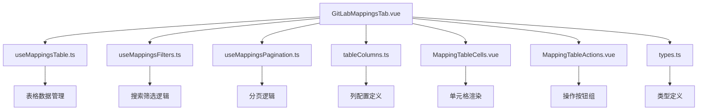
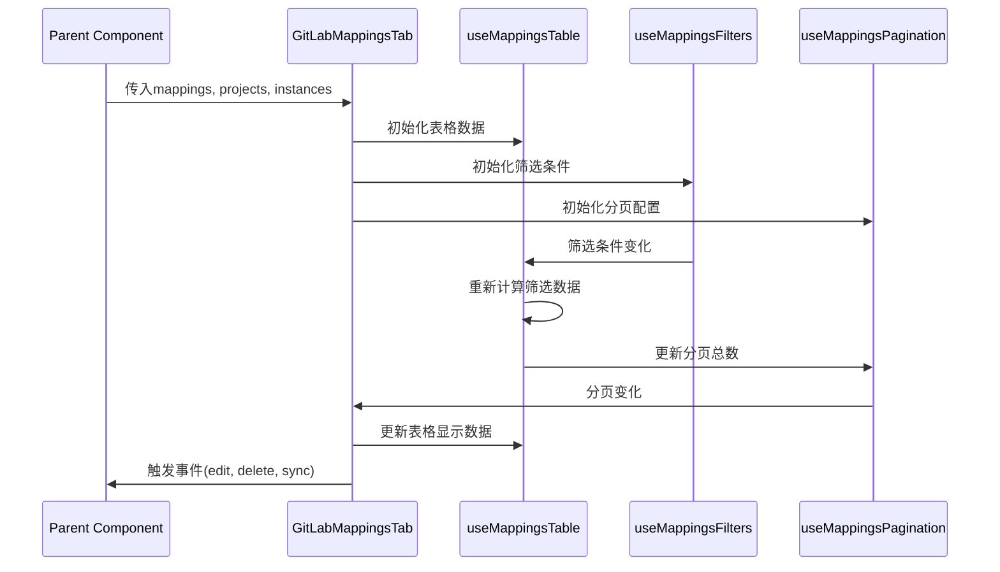

# GitLabMappingsTab组件重构 - 设计文档

## 整体架构设计

### 架构图


## 分层设计

### 1. 主组件层 (GitLabMappingsTab.vue)
**职责**: 组件入口，协调各子模块
**内容**:
- 模板结构
- 基础样式
- 组件组合逻辑

### 2. Composables层
**职责**: 封装可复用的业务逻辑

#### useMappingsTable.ts
- 表格数据管理
- 数据筛选逻辑
- 表格状态管理

#### useMappingsFilters.ts
- 搜索逻辑
- 筛选条件管理
- 筛选状态同步

#### useMappingsPagination.ts
- 分页配置
- 分页状态管理
- 分页事件处理

### 3. 配置层
**职责**: 静态配置数据

#### tableColumns.ts
- 表格列定义
- 列配置常量
- 列宽和排序配置

#### types.ts
- 组件相关类型定义
- 接口定义
- 枚举定义

### 4. 子组件层
**职责**: 特定UI功能组件

#### MappingTableCells.vue
- 项目信息单元格
- GitLab分组单元格
- 实例信息单元格
- 状态单元格
- 时间单元格

#### MappingTableActions.vue
- 操作按钮组
- 按钮状态管理
- 确认对话框

## 核心组件设计

### GitLabMappingsTab.vue (主组件)
```typescript
// 主要职责
- 组合各个composables
- 渲染主模板结构
- 处理组件间通信
- 管理组件状态
```

### useMappingsTable.ts (表格逻辑)
```typescript
// 主要功能
- 管理表格数据
- 处理数据筛选
- 管理表格状态
- 提供表格操作方法
```

### useMappingsFilters.ts (筛选逻辑)
```typescript
// 主要功能
- 管理搜索条件
- 处理筛选逻辑
- 同步筛选状态
- 提供筛选方法
```

### useMappingsPagination.ts (分页逻辑)
```typescript
// 主要功能
- 管理分页配置
- 处理分页事件
- 计算分页数据
- 提供分页方法
```

## 接口设计

### Props接口
```typescript
interface GitLabMappingsTabProps {
  mappings: MappingItem[];
  projects: ProjectItem[];
  instances: InstanceItem[];
  loading: boolean;
}
```

### Emits接口
```typescript
interface GitLabMappingsTabEmits {
  refresh: [];
  create: [];
  edit: [mapping: MappingItem];
  delete: [mapping: MappingItem];
  sync: [mapping: MappingItem];
}
```

### Composables接口
```typescript
// useMappingsTable
interface UseMappingsTableReturn {
  filteredMappings: ComputedRef<MappingItem[]>;
  tableLoading: Ref<boolean>;
  refreshTable: () => void;
}

// useMappingsFilters
interface UseMappingsFiltersReturn {
  searchText: Ref<string>;
  projectFilter: Ref<string>;
  instanceFilter: Ref<string>;
  statusFilter: Ref<string>;
  handleSearch: () => void;
  handleFilter: () => void;
  resetFilters: () => void;
}

// useMappingsPagination
interface UseMappingsPaginationReturn {
  pagination: Ref<PaginationConfig>;
  handleTableChange: (pag: any) => void;
  resetPagination: () => void;
}
```

## 数据流向图



## 异常处理策略

### 错误边界
- 每个composable都有独立的错误处理
- 主组件提供统一的错误处理机制
- 子组件错误不会影响主组件

### 数据验证
- 输入数据验证
- 状态一致性检查
- 边界条件处理

### 降级策略
- 筛选失败时显示原始数据
- 分页失败时重置到第一页
- 组件加载失败时显示错误信息

## 性能优化策略

### 计算属性优化
- 使用computed缓存筛选结果
- 避免不必要的重新计算
- 合理使用watch监听

### 组件懒加载
- 子组件按需加载
- 减少初始包大小

### 内存管理
- 及时清理事件监听
- 避免内存泄漏
- 合理使用ref和reactive

## 测试策略

### 单元测试
- 每个composable独立测试
- 子组件独立测试
- 工具函数测试

### 集成测试
- 主组件集成测试
- 用户交互测试
- 数据流测试

### 性能测试
- 大数据量渲染测试
- 筛选性能测试
- 分页性能测试
