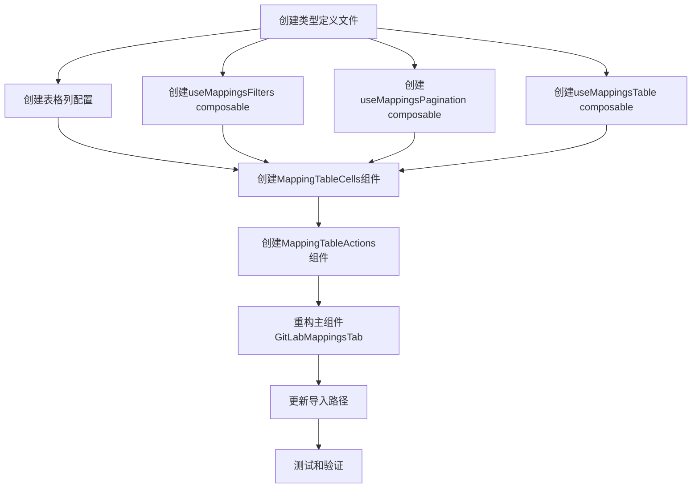

# GitLabMappingsTab组件重构 - 任务分解

## 任务依赖图

## 原子任务列表

### 任务1: 创建类型定义文件
**文件**: `client/src/components/GitLabIntegration/types/mappings.types.ts`
**输入契约**:
- 现有组件中的类型定义
- 项目中的相关类型定义

**输出契约**:
- 完整的类型定义文件
- 包含所有相关接口和类型
- 导出所有必要的类型

**实现约束**:
- 使用TypeScript严格模式
- 遵循项目命名规范
- 提供完整的类型注释

**依赖关系**:
- 无前置依赖
- 为其他任务提供类型支持

### 任务2: 创建表格列配置
**文件**: `client/src/components/GitLabIntegration/config/tableColumns.ts`
**输入契约**:
- 现有组件中的列配置
- 列宽和排序要求

**输出契约**:
- 完整的列配置数组
- 可配置的列定义
- 类型安全的列配置

**实现约束**:
- 保持现有列配置不变
- 支持动态列配置
- 提供类型定义

**依赖关系**:
- 依赖任务1的类型定义
- 为任务6提供列配置

### 任务3: 创建useMappingsFilters composable
**文件**: `client/src/composables/useMappingsFilters.ts`
**输入契约**:
- 筛选逻辑需求
- 搜索功能需求

**输出契约**:
- 完整的筛选逻辑
- 搜索和筛选方法
- 筛选状态管理

**实现约束**:
- 使用Vue 3 Composition API
- 提供响应式状态
- 支持筛选重置

**依赖关系**:
- 依赖任务1的类型定义
- 为任务7提供筛选逻辑

### 任务4: 创建useMappingsPagination composable
**文件**: `client/src/composables/useMappingsPagination.ts`
**输入契约**:
- 分页功能需求
- 分页配置要求

**输出契约**:
- 完整的分页逻辑
- 分页状态管理
- 分页事件处理

**实现约束**:
- 使用Vue 3 Composition API
- 支持分页配置
- 提供分页方法

**依赖关系**:
- 依赖任务1的类型定义
- 为任务7提供分页逻辑

### 任务5: 创建useMappingsTable composable
**文件**: `client/src/composables/useMappingsTable.ts`
**输入契约**:
- 表格数据管理需求
- 筛选和分页集成需求

**输出契约**:
- 完整的表格数据管理
- 筛选数据计算
- 表格状态管理

**实现约束**:
- 集成筛选和分页逻辑
- 提供表格操作方法
- 支持数据刷新

**依赖关系**:
- 依赖任务1、3、4
- 为任务7提供表格逻辑

### 任务6: 创建MappingTableCells组件
**文件**: `client/src/components/GitLabIntegration/MappingTableCells.vue`
**输入契约**:
- 单元格渲染需求
- 现有单元格样式

**输出契约**:
- 完整的单元格组件
- 所有单元格类型支持
- 保持现有样式

**实现约束**:
- 使用Vue 3 Composition API
- 保持现有样式
- 支持所有单元格类型

**依赖关系**:
- 依赖任务1、2
- 为任务8提供单元格组件

### 任务7: 创建MappingTableActions组件
**文件**: `client/src/components/GitLabIntegration/MappingTableActions.vue`
**输入契约**:
- 操作按钮需求
- 确认对话框需求

**输出契约**:
- 完整的操作按钮组件
- 确认对话框功能
- 按钮状态管理

**实现约束**:
- 使用Vue 3 Composition API
- 保持现有交互效果
- 支持按钮状态管理

**依赖关系**:
- 依赖任务1
- 为任务8提供操作组件

### 任务8: 重构主组件GitLabMappingsTab
**文件**: `client/src/components/GitLabIntegration/GitLabMappingsTab.vue`
**输入契约**:
- 所有子模块和composables
- 现有组件功能

**输出契约**:
- 重构后的主组件
- 保持所有现有功能
- 清晰的组件结构

**实现约束**:
- 保持现有接口不变
- 使用新的子模块
- 保持现有样式

**依赖关系**:
- 依赖任务1-7
- 为任务9提供主组件

### 任务9: 更新导入路径
**文件**: `client/src/views/GitLabIntegration.vue`
**输入契约**:
- 重构后的组件结构
- 现有导入路径

**输出契约**:
- 更新后的导入路径
- 确保组件正常工作

**实现约束**:
- 保持现有功能不变
- 更新导入路径
- 确保类型安全

**依赖关系**:
- 依赖任务8
- 为任务10提供基础

### 任务10: 测试和验证
**文件**: 测试相关
**输入契约**:
- 重构后的所有组件
- 现有功能需求

**输出契约**:
- 功能测试通过
- 性能测试通过
- 代码质量检查通过

**实现约束**:
- 全面测试所有功能
- 确保性能不下降
- 代码质量符合标准

**依赖关系**:
- 依赖任务1-9
- 最终验收任务

## 验收标准

### 功能验收
- [ ] 搜索功能正常工作
- [ ] 筛选功能正常工作
- [ ] 分页功能正常工作
- [ ] 表格展示正常
- [ ] 操作按钮功能正常
- [ ] 所有事件正确触发

### 代码质量验收
- [ ] 代码结构清晰，职责分离明确
- [ ] 可复用性提高
- [ ] 可测试性提高
- [ ] 类型安全
- [ ] 符合Vue 3最佳实践

### 兼容性验收
- [ ] 与父组件接口完全兼容
- [ ] 样式和交互效果保持一致
- [ ] 性能无显著下降

