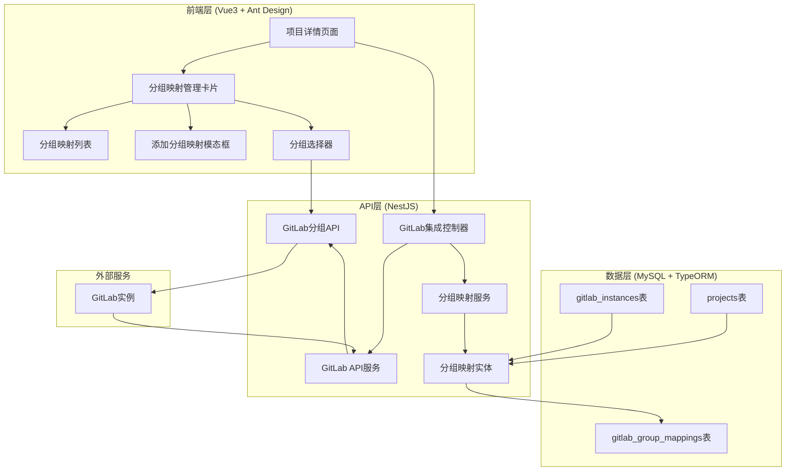
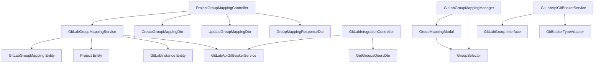
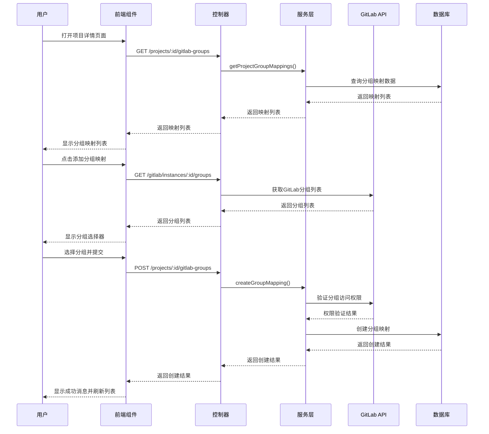

# DESIGN_GitLab分组映射功能

## 整体架构图



## 分层设计和核心组件

### 1. 数据层 (Data Layer)

#### 1.1 GitLabGroupMapping实体
```typescript
@Entity('gitlab_group_mappings')
@Index('idx_gitlab_group_mappings_project', ['projectId'])
@Index('idx_gitlab_group_mappings_instance', ['gitlabInstanceId'])
@Index('idx_gitlab_group_mappings_gitlab_group', ['gitlabGroupId'])
@Index('idx_gitlab_group_mappings_active', ['isActive'])
@Index('unique_group_mapping', ['projectId', 'gitlabInstanceId', 'gitlabGroupId'], { unique: true })
export class GitLabGroupMapping {
  @PrimaryGeneratedColumn('uuid')
  id!: string;

  @Column({ type: 'varchar', length: 36, comment: '项目管理工具项目ID' })
  projectId!: string;

  @Column({ type: 'varchar', length: 36, comment: 'GitLab实例ID' })
  gitlabInstanceId!: string;

  @Column({ type: 'int', comment: 'GitLab分组ID' })
  gitlabGroupId!: number;

  @Column({ type: 'varchar', length: 500, comment: 'GitLab分组路径' })
  gitlabGroupPath!: string;

  @Column({ type: 'boolean', default: true, comment: '是否激活' })
  isActive!: boolean;

  @CreateDateColumn({ comment: '创建时间' })
  createdAt!: Date;

  @UpdateDateColumn({ comment: '更新时间' })
  updatedAt!: Date;

  // 关联关系
  @ManyToOne(() => Project, project => project.id, { onDelete: 'CASCADE' })
  @JoinColumn({ name: 'projectId' })
  project!: Project;

  @ManyToOne(() => GitLabInstance, instance => instance.groupMappings, { onDelete: 'CASCADE' })
  @JoinColumn({ name: 'gitlabInstanceId' })
  gitlabInstance!: GitLabInstance;
}
```

#### 1.2 数据库迁移
```sql
-- 创建分组映射表
CREATE TABLE `gitlab_group_mappings` (
  `id` varchar(36) NOT NULL,
  `projectId` varchar(36) NOT NULL,
  `gitlabInstanceId` varchar(36) NOT NULL,
  `gitlabGroupId` int NOT NULL,
  `gitlabGroupPath` varchar(500) NOT NULL,
  `isActive` tinyint(1) NOT NULL DEFAULT 1,
  `createdAt` datetime(6) NOT NULL DEFAULT CURRENT_TIMESTAMP(6),
  `updatedAt` datetime(6) NOT NULL DEFAULT CURRENT_TIMESTAMP(6) ON UPDATE CURRENT_TIMESTAMP(6),
  PRIMARY KEY (`id`),
  UNIQUE KEY `unique_group_mapping` (`projectId`, `gitlabInstanceId`, `gitlabGroupId`),
  KEY `idx_gitlab_group_mappings_project` (`projectId`),
  KEY `idx_gitlab_group_mappings_instance` (`gitlabInstanceId`),
  KEY `idx_gitlab_group_mappings_gitlab_group` (`gitlabGroupId`),
  KEY `idx_gitlab_group_mappings_active` (`isActive`),
  CONSTRAINT `FK_gitlab_group_mappings_project` FOREIGN KEY (`projectId`) REFERENCES `projects` (`id`) ON DELETE CASCADE,
  CONSTRAINT `FK_gitlab_group_mappings_instance` FOREIGN KEY (`gitlabInstanceId`) REFERENCES `gitlab_instances` (`id`) ON DELETE CASCADE
) ENGINE=InnoDB DEFAULT CHARSET=utf8mb4 COLLATE=utf8mb4_unicode_ci;
```

### 2. 服务层 (Service Layer)

#### 2.1 GitLabGroupMappingService
```typescript
@Injectable()
export class GitLabGroupMappingService {
  constructor(
    @InjectRepository(GitLabGroupMapping)
    private readonly groupMappingRepository: Repository<GitLabGroupMapping>,
    @InjectRepository(Project)
    private readonly projectRepository: Repository<Project>,
    @InjectRepository(GitLabInstance)
    private readonly gitlabInstanceRepository: Repository<GitLabInstance>,
    private readonly gitlabApiService: GitLabApiGitBeakerService,
  ) {}

  // 创建分组映射
  async createGroupMapping(projectId: string, dto: CreateGroupMappingDto): Promise<GroupMappingResponseDto>;

  // 获取项目的分组映射列表
  async getProjectGroupMappings(projectId: string): Promise<GroupMappingResponseDto[]>;

  // 更新分组映射
  async updateGroupMapping(mappingId: string, dto: UpdateGroupMappingDto): Promise<GroupMappingResponseDto>;

  // 删除分组映射
  async deleteGroupMapping(mappingId: string): Promise<void>;

  // 验证分组访问权限
  private async validateGroupAccess(instance: GitLabInstance, groupId: number): Promise<boolean>;
}
```

#### 2.2 GitLab API服务扩展
```typescript
// 在GitLabApiGitBeakerService中添加
export class GitLabApiGitBeakerService {
  // 获取分组列表
  async getGroups(
    instance: GitLabInstance,
    options?: {
      search?: string;
      visibility?: 'private' | 'internal' | 'public';
      orderBy?: 'id' | 'name' | 'path' | 'created_at' | 'updated_at';
      sort?: 'asc' | 'desc';
      page?: number;
      perPage?: number;
    }
  ): Promise<{ groups: GitLabGroup[]; pagination: PaginationInfo }>;

  // 获取分组详情
  async getGroup(instance: GitLabInstance, groupId: number): Promise<GitLabGroup>;
}
```

### 3. 控制器层 (Controller Layer)

#### 3.1 GitLab集成控制器扩展
```typescript
@Controller('gitlab')
export class GitLabIntegrationController {
  // 获取GitLab分组列表
  @Get('instances/:instanceId/groups')
  async getGitLabGroups(
    @Param('instanceId') instanceId: string,
    @Query() query: GetGroupsQueryDto
  ): Promise<{ groups: GitLabGroup[]; pagination: PaginationInfo }>;

  // 获取GitLab分组详情
  @Get('instances/:instanceId/groups/:groupId')
  async getGitLabGroup(
    @Param('instanceId') instanceId: string,
    @Param('groupId') groupId: number
  ): Promise<GitLabGroup>;
}

// 项目分组映射控制器
@Controller('projects/:projectId/gitlab-groups')
export class ProjectGroupMappingController {
  // 获取项目的分组映射列表
  @Get()
  async getProjectGroupMappings(@Param('projectId') projectId: string): Promise<GroupMappingResponseDto[]>;

  // 创建分组映射
  @Post()
  async createGroupMapping(
    @Param('projectId') projectId: string,
    @Body() dto: CreateGroupMappingDto
  ): Promise<GroupMappingResponseDto>;

  // 更新分组映射
  @Put(':mappingId')
  async updateGroupMapping(
    @Param('projectId') projectId: string,
    @Param('mappingId') mappingId: string,
    @Body() dto: UpdateGroupMappingDto
  ): Promise<GroupMappingResponseDto>;

  // 删除分组映射
  @Delete(':mappingId')
  async deleteGroupMapping(
    @Param('projectId') projectId: string,
    @Param('mappingId') mappingId: string
  ): Promise<void>;
}
```

### 4. 前端层 (Frontend Layer)

#### 4.1 分组映射管理组件
```vue
<!-- GitLabGroupMappingManager.vue -->
<template>
  <a-card title="GitLab分组映射" class="group-mapping-card">
    <template #extra>
      <a-button type="primary" @click="showAddModal = true" :disabled="!canManage">
        添加分组映射
      </a-button>
    </template>

    <a-table
      :columns="columns"
      :data-source="mappings"
      :loading="loading"
      :pagination="pagination"
      row-key="id"
    >
      <template #groupInfo="{ record }">
        <div class="group-info">
          <div class="group-name">{{ record.groupName }}</div>
          <div class="group-path">{{ record.groupPath }}</div>
        </div>
      </template>

      <template #status="{ record }">
        <a-tag :color="record.isActive ? 'green' : 'red'">
          {{ record.isActive ? '激活' : '禁用' }}
        </a-tag>
      </template>

      <template #action="{ record }">
        <a-space>
          <a-button size="small" @click="editMapping(record)">编辑</a-button>
          <a-button size="small" danger @click="deleteMapping(record)">删除</a-button>
        </a-space>
      </template>
    </a-table>

    <!-- 添加/编辑分组映射模态框 -->
    <GroupMappingModal
      v-model:open="showAddModal"
      :project-id="projectId"
      :mapping="editingMapping"
      @success="loadMappings"
    />
  </a-card>
</template>
```

#### 4.2 分组选择器组件
```vue
<!-- GroupSelector.vue -->
<template>
  <a-select
    v-model:value="selectedGroupId"
    placeholder="选择GitLab分组"
    :loading="loading"
    :filter-option="false"
    show-search
    @search="handleSearch"
    @dropdown-visible-change="handleDropdownVisibleChange"
  >
    <a-select-option
      v-for="group in groups"
      :key="group.id"
      :value="group.id"
    >
      <div class="group-option">
        <div class="group-name">{{ group.name }}</div>
        <div class="group-path">{{ group.full_path }}</div>
      </div>
    </a-select-option>
  </a-select>
</template>
```

## 模块依赖关系图



## 接口契约定义

### 1. DTO定义

#### CreateGroupMappingDto
```typescript
export class CreateGroupMappingDto {
  @IsString()
  @IsNotEmpty()
  gitlabInstanceId: string;

  @IsNumber()
  @IsNotEmpty()
  gitlabGroupId: number;

  @IsString()
  @IsNotEmpty()
  gitlabGroupPath: string;
}
```

#### UpdateGroupMappingDto
```typescript
export class UpdateGroupMappingDto {
  @IsBoolean()
  @IsOptional()
  isActive?: boolean;
}
```

#### GroupMappingResponseDto
```typescript
export class GroupMappingResponseDto {
  id: string;
  projectId: string;
  gitlabInstanceId: string;
  gitlabGroupId: number;
  gitlabGroupPath: string;
  groupName: string;
  groupFullPath: string;
  groupDescription?: string;
  groupVisibility: string;
  groupProjectsCount: number;
  isActive: boolean;
  createdAt: Date;
  updatedAt: Date;
}
```

### 2. API接口定义

#### 获取GitLab分组列表
```typescript
GET /gitlab/instances/:instanceId/groups
Query Parameters:
- search?: string
- visibility?: 'private' | 'internal' | 'public'
- orderBy?: 'id' | 'name' | 'path' | 'created_at' | 'updated_at'
- sort?: 'asc' | 'desc'
- page?: number
- perPage?: number

Response:
{
  groups: GitLabGroup[];
  pagination: {
    page: number;
    perPage: number;
    total: number;
    totalPages: number;
  };
}
```

#### 创建分组映射
```typescript
POST /projects/:projectId/gitlab-groups
Body: CreateGroupMappingDto

Response: GroupMappingResponseDto
```

## 数据流向图



## 异常处理策略

### 1. 业务异常
- **分组不存在**: 返回404错误
- **权限不足**: 返回403错误
- **映射已存在**: 返回409冲突错误
- **分组访问权限验证失败**: 返回400错误

### 2. 技术异常
- **GitLab API连接失败**: 返回503服务不可用
- **数据库操作失败**: 返回500内部服务器错误
- **参数验证失败**: 返回400错误请求

### 3. 前端异常处理
- **网络错误**: 显示友好的错误提示
- **权限错误**: 显示权限不足提示
- **验证错误**: 显示字段级错误信息

### 4. 日志记录
- **操作日志**: 记录所有CRUD操作
- **错误日志**: 记录详细的错误信息
- **性能日志**: 记录API响应时间

## 安全考虑

### 1. 权限控制
- 只有管理员和项目管理员可以管理分组映射
- 创建映射时验证用户对GitLab分组的访问权限
- 使用JWT令牌进行身份验证

### 2. 数据验证
- 输入参数严格验证
- SQL注入防护
- XSS攻击防护

### 3. 审计日志
- 记录所有映射操作
- 记录用户操作时间
- 支持操作回滚

## 性能优化

### 1. 数据库优化
- 合理的索引设计
- 分页查询支持
- 软删除机制

### 2. 缓存策略
- GitLab分组列表缓存
- 映射关系缓存
- 实例信息缓存

### 3. 前端优化
- 组件懒加载
- 虚拟滚动（大量数据）
- 防抖搜索
