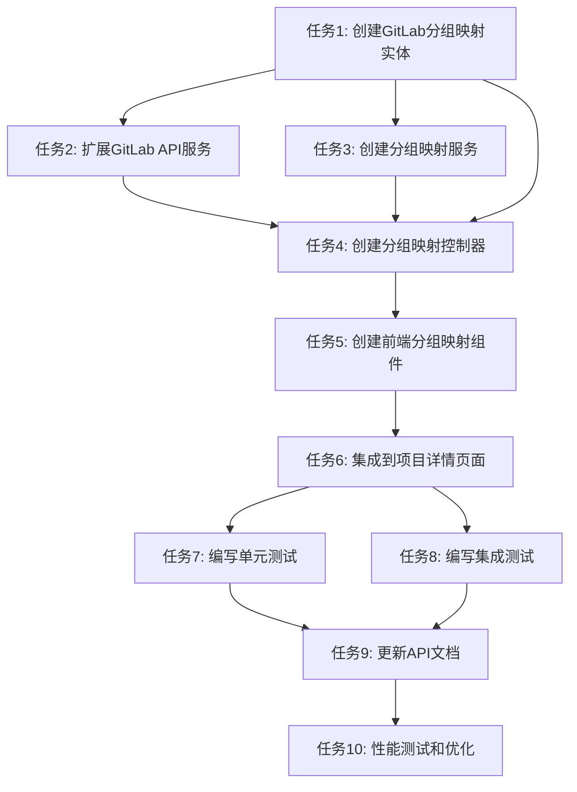

# TASK_GitLab分组映射功能

## 任务依赖图

## 原子任务列表

### 任务1: 创建GitLab分组映射实体
**状态**: pending  
**优先级**: 高  
**预估时间**: 2小时

#### 输入契约
- 现有GitLab集成实体结构
- 项目实体和GitLab实例实体
- 数据库设计规范

#### 输出契约
- GitLabGroupMapping实体类
- 数据库迁移脚本
- 实体单元测试

#### 实现约束
- 使用TypeORM装饰器
- 遵循现有实体命名规范
- 包含完整的索引和约束
- 支持软删除机制

#### 验收标准
- 实体定义完整且正确
- 数据库迁移脚本可执行
- 单元测试通过
- 与现有实体关系正确

---

### 任务2: 扩展GitLab API服务
**状态**: pending  
**优先级**: 高  
**预估时间**: 3小时

#### 输入契约
- 现有GitLabApiGitBeakerService
- GitLabGroup接口定义
- GitBeakerTypeAdapter

#### 输出契约
- getGroups方法实现
- getGroup方法实现
- 分组列表分页支持
- 分组搜索功能

#### 实现约束
- 使用@gitbeaker/rest客户端
- 遵循现有API服务模式
- 包含完整的错误处理
- 支持分页和搜索参数

#### 验收标准
- API方法正确实现
- 错误处理完整
- 分页功能正常
- 搜索功能正常

---

### 任务3: 创建分组映射服务
**状态**: pending  
**优先级**: 高  
**预估时间**: 4小时

#### 输入契约
- GitLabGroupMapping实体
- 现有项目服务和GitLab实例服务
- GitLab API服务

#### 输出契约
- GitLabGroupMappingService类
- 完整的CRUD操作方法
- 权限验证逻辑
- DTO定义

#### 实现约束
- 使用NestJS依赖注入
- 遵循现有服务层模式
- 包含完整的业务逻辑验证
- 支持事务处理

#### 验收标准
- 服务方法完整实现
- 权限验证正确
- 业务逻辑验证完整
- 异常处理正确

---

### 任务4: 创建分组映射控制器
**状态**: pending  
**优先级**: 高  
**预估时间**: 3小时

#### 输入契约
- GitLabGroupMappingService
- 现有GitLab集成控制器
- 权限守卫和验证管道

#### 输出契约
- ProjectGroupMappingController类
- 完整的REST API端点
- 请求验证和响应格式化
- API文档注解

#### 实现约束
- 使用NestJS控制器装饰器
- 遵循现有API设计规范
- 包含完整的Swagger文档
- 使用统一的错误处理

#### 验收标准
- API端点正确实现
- 请求验证完整
- 响应格式统一
- Swagger文档完整

---

### 任务5: 创建前端分组映射组件
**状态**: pending  
**优先级**: 中  
**预估时间**: 6小时

#### 输入契约
- 现有Vue3组件结构
- Ant Design组件库
- 项目API接口

#### 输出契约
- GitLabGroupMappingManager组件
- GroupMappingModal组件
- GroupSelector组件
- 相关类型定义

#### 实现约束
- 使用Vue3 Composition API
- 遵循现有组件设计模式
- 使用Ant Design组件
- 包含完整的表单验证

#### 验收标准
- 组件功能完整
- 界面友好易用
- 表单验证正确
- 响应式设计

---

### 任务6: 集成到项目详情页面
**状态**: pending  
**优先级**: 中  
**预估时间**: 2小时

#### 输入契约
- 现有ProjectDetail.vue页面
- GitLabGroupMappingManager组件
- 项目权限控制

#### 输出契约
- 更新后的ProjectDetail.vue
- 分组映射管理卡片
- 权限控制集成

#### 实现约束
- 保持现有页面结构
- 遵循现有权限控制模式
- 保持界面一致性
- 不影响现有功能

#### 验收标准
- 页面集成正确
- 权限控制有效
- 界面布局合理
- 功能正常可用

---

### 任务7: 编写单元测试
**状态**: pending  
**优先级**: 中  
**预估时间**: 4小时

#### 输入契约
- 所有服务层和控制器代码
- 现有测试框架配置
- 测试数据准备

#### 输出契约
- 实体单元测试
- 服务层单元测试
- 控制器单元测试
- 测试覆盖率报告

#### 实现约束
- 使用Jest测试框架
- 遵循现有测试模式
- 包含边界条件测试
- 模拟外部依赖

#### 验收标准
- 测试覆盖率 > 80%
- 所有测试用例通过
- 边界条件覆盖完整
- 测试代码质量良好

---

### 任务8: 编写集成测试
**状态**: pending  
**优先级**: 中  
**预估时间**: 3小时

#### 输入契约
- 完整的API端点
- 测试数据库配置
- 模拟GitLab API响应

#### 输出契约
- API集成测试
- 端到端测试
- 数据库集成测试
- 测试报告

#### 实现约束
- 使用现有测试框架
- 包含完整的API流程测试
- 模拟外部服务
- 清理测试数据

#### 验收标准
- 所有集成测试通过
- API流程测试完整
- 数据库操作正确
- 测试数据清理完整

---

### 任务9: 更新API文档
**状态**: pending  
**优先级**: 低  
**预估时间**: 2小时

#### 输入契约
- 完整的API实现
- 现有API文档结构
- Swagger注解

#### 输出契约
- 更新的API文档
- 新的接口说明
- 请求响应示例
- 错误码说明

#### 实现约束
- 遵循现有文档格式
- 包含完整的接口说明
- 提供清晰的示例
- 保持文档一致性

#### 验收标准
- 文档内容完整
- 示例正确有效
- 格式统一规范
- 易于理解使用

---

### 任务10: 性能测试和优化
**状态**: pending  
**优先级**: 低  
**预估时间**: 3小时

#### 输入契约
- 完整的系统实现
- 性能测试工具
- 测试数据准备

#### 输出契约
- 性能测试报告
- 优化建议
- 性能基准
- 监控指标

#### 实现约束
- 使用现有性能测试工具
- 测试真实使用场景
- 包含压力测试
- 监控关键指标

#### 验收标准
- 性能指标达标
- 优化建议可行
- 监控指标合理
- 系统稳定性良好

## 任务执行顺序

### 第一阶段 (核心功能)
1. 任务1: 创建GitLab分组映射实体
2. 任务2: 扩展GitLab API服务
3. 任务3: 创建分组映射服务

### 第二阶段 (API层)
4. 任务4: 创建分组映射控制器

### 第三阶段 (前端层)
5. 任务5: 创建前端分组映射组件
6. 任务6: 集成到项目详情页面

### 第四阶段 (测试和文档)
7. 任务7: 编写单元测试
8. 任务8: 编写集成测试
9. 任务9: 更新API文档
10. 任务10: 性能测试和优化

## 风险控制

### 高风险任务
- 任务2: 扩展GitLab API服务 - 依赖外部API
- 任务5: 创建前端分组映射组件 - 复杂度较高

### 风险缓解措施
- 充分测试GitLab API集成
- 分步骤实现前端组件
- 及时进行代码审查
- 保持与现有架构的一致性

## 质量保证

### 代码质量
- 遵循现有代码规范
- 完整的错误处理
- 充分的注释说明
- 合理的代码结构

### 测试质量
- 单元测试覆盖率 > 80%
- 集成测试覆盖主要流程
- 边界条件测试完整
- 性能测试达标

### 文档质量
- API文档完整准确
- 代码注释清晰
- 用户指南易懂
- 维护文档完整
