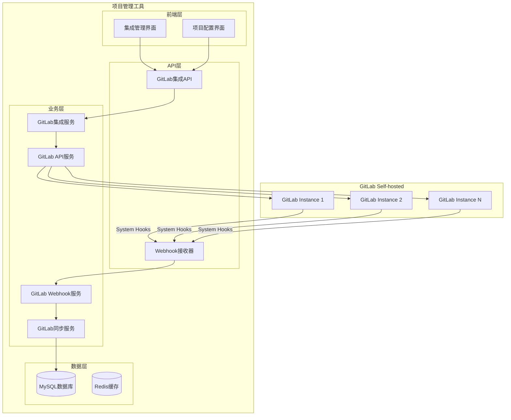
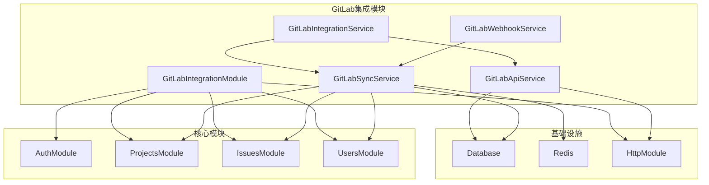
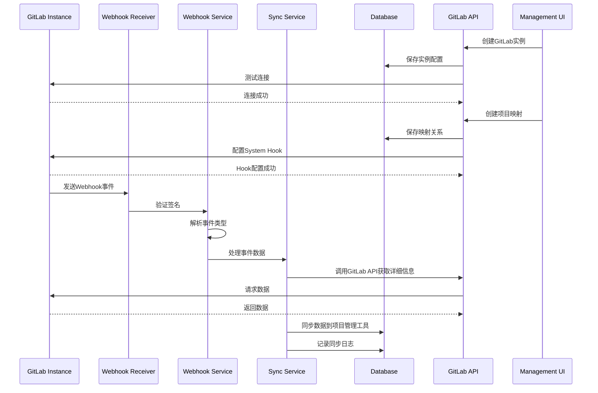

# GitLab集成功能 - 架构设计阶段

## 整体架构图



## 分层设计和核心组件

### 1. 表现层（Web界面）

#### 集成管理界面（System Admin）
- GitLab实例管理
- 全局配置设置
- 系统级监控和日志

#### 项目配置界面（Project Admin + System Admin）
- 项目与GitLab项目映射
- 项目级集成配置
- 同步状态监控

### 2. 应用层（API服务）

#### GitLab集成控制器
```typescript
@Controller('gitlab')
@UseGuards(JwtAuthGuard, RolesGuard)
@Roles('system_admin')
export class GitLabIntegrationController {
  // 实例管理
  @Get('instances')
  async getInstances() {}
  
  @Post('instances')
  async createInstance() {}
  
  @Put('instances/:id')
  async updateInstance() {}
  
  @Delete('instances/:id')
  async deleteInstance() {}
  
  @Post('instances/:id/test')
  async testConnection() {}
}
```

#### 项目映射控制器
```typescript
@Controller('projects/:projectId/gitlab')
@UseGuards(JwtAuthGuard, RolesGuard)
@Roles('project_admin', 'system_admin')
export class ProjectMappingController {
  @Get('mappings')
  async getMappings() {}
  
  @Post('mappings')
  async createMapping() {}
  
  @Delete('mappings/:id')
  async deleteMapping() {}
  
  @Post('sync')
  async manualSync() {}
}
```

#### Webhook接收控制器
```typescript
@Controller('gitlab/webhook')
export class GitLabWebhookController {
  @Post(':instanceId')
  async handleWebhook() {}
}
```

### 3. 领域层（业务服务）

#### GitLab集成服务
```typescript
@Injectable()
export class GitLabIntegrationService {
  // 实例管理
  async createInstance(dto: CreateGitLabInstanceDto) {}
  async updateInstance(id: string, dto: UpdateGitLabInstanceDto) {}
  async deleteInstance(id: string) {}
  async testConnection(instanceId: string) {}
  
  // 项目映射管理
  async createProjectMapping(projectId: string, dto: CreateProjectMappingDto) {}
  async deleteProjectMapping(mappingId: string) {}
  async getProjectMappings(projectId: string) {}
}
```

#### GitLab API服务
```typescript
@Injectable()
export class GitLabApiService {
  // API调用
  async getProjects(instanceId: string) {}
  async getProject(instanceId: string, projectId: number) {}
  async getIssues(instanceId: string, projectId: number) {}
  async getMergeRequests(instanceId: string, projectId: number) {}
  async getPipelines(instanceId: string, projectId: number) {}
  
  // 用户同步
  async syncUsers(instanceId: string) {}
  async syncProjectMembers(instanceId: string, projectId: number) {}
}
```

#### GitLab Webhook服务
```typescript
@Injectable()
export class GitLabWebhookService {
  // 事件处理
  async handlePushEvent(eventData: any) {}
  async handleMergeRequestEvent(eventData: any) {}
  async handleIssueEvent(eventData: any) {}
  async handlePipelineEvent(eventData: any) {}
  
  // 签名验证
  async verifySignature(payload: string, signature: string, secret: string) {}
}
```

#### GitLab同步服务
```typescript
@Injectable()
export class GitLabSyncService {
  // 数据同步
  async syncIssue(gitlabIssue: any, projectId: string) {}
  async syncMergeRequest(gitlabMR: any, projectId: string) {}
  async updateTaskFromCommit(commit: any, projectId: string) {}
  async updateTaskFromPipeline(pipeline: any, projectId: string) {}
  
  // 状态映射
  async mapGitLabStatusToTaskStatus(gitlabStatus: string) {}
  async mapTaskStatusToGitLabStatus(taskStatus: string) {}
}
```

### 4. 基础设施层（数据存储）

#### 实体定义
```typescript
@Entity('gitlab_instances')
export class GitLabInstance {
  @PrimaryGeneratedColumn('uuid')
  id: string;
  
  @Column()
  name: string;
  
  @Column()
  baseUrl: string;
  
  @Column()
  apiToken: string; // 加密存储
  
  @Column({ nullable: true })
  webhookSecret: string;
  
  @Column({ default: true })
  isActive: boolean;
  
  @Column({ type: 'enum', enum: ['self_hosted', 'gitlab_com'], default: 'self_hosted' })
  instanceType: string;
  
  @CreateDateColumn()
  createdAt: Date;
  
  @UpdateDateColumn()
  updatedAt: Date;
}

@Entity('gitlab_project_mappings')
export class GitLabProjectMapping {
  @PrimaryGeneratedColumn('uuid')
  id: string;
  
  @Column()
  projectId: string;
  
  @Column()
  gitlabInstanceId: string;
  
  @Column()
  gitlabProjectId: number;
  
  @Column()
  gitlabProjectPath: string;
  
  @Column({ nullable: true })
  webhookId: string;
  
  @Column({ default: true })
  isActive: boolean;
  
  @CreateDateColumn()
  createdAt: Date;
  
  @UpdateDateColumn()
  updatedAt: Date;
  
  @ManyToOne(() => Project)
  project: Project;
  
  @ManyToOne(() => GitLabInstance)
  gitlabInstance: GitLabInstance;
}
```

## 模块依赖关系图



## 接口契约定义

### 1. GitLab实例管理接口

```typescript
// 创建GitLab实例
interface CreateGitLabInstanceDto {
  name: string;
  baseUrl: string;
  apiToken: string;
  webhookSecret?: string;
  instanceType: 'self_hosted' | 'gitlab_com';
}

// 更新GitLab实例
interface UpdateGitLabInstanceDto {
  name?: string;
  baseUrl?: string;
  apiToken?: string;
  webhookSecret?: string;
  isActive?: boolean;
}

// GitLab实例响应
interface GitLabInstanceResponse {
  id: string;
  name: string;
  baseUrl: string;
  instanceType: string;
  isActive: boolean;
  createdAt: string;
  updatedAt: string;
}
```

### 2. 项目映射管理接口

```typescript
// 创建项目映射
interface CreateProjectMappingDto {
  gitlabInstanceId: string;
  gitlabProjectId: number;
  gitlabProjectPath: string;
}

// 项目映射响应
interface ProjectMappingResponse {
  id: string;
  projectId: string;
  gitlabInstanceId: string;
  gitlabProjectId: number;
  gitlabProjectPath: string;
  isActive: boolean;
  createdAt: string;
  updatedAt: string;
}
```

### 3. Webhook事件接口

```typescript
// Webhook事件基础结构
interface GitLabWebhookEvent {
  object_kind: string;
  event_type: string;
  user: any;
  project: any;
  repository: any;
  object_attributes: any;
  created_at: string;
  updated_at: string;
}

// Push事件
interface PushEvent extends GitLabWebhookEvent {
  object_kind: 'push';
  ref: string;
  before: string;
  after: string;
  commits: Commit[];
}

// Merge Request事件
interface MergeRequestEvent extends GitLabWebhookEvent {
  object_kind: 'merge_request';
  object_attributes: {
    id: number;
    title: string;
    description: string;
    state: string;
    merge_status: string;
    source_branch: string;
    target_branch: string;
    author_id: number;
    assignee_id?: number;
  };
}
```

## 数据流向图



## 异常处理策略

### 1. 连接异常处理
```typescript
// GitLab API连接异常
class GitLabConnectionException extends Error {
  constructor(message: string, public instanceId: string) {
    super(message);
  }
}

// 处理策略
- 重试机制：指数退避重试
- 降级处理：标记实例为不可用
- 告警通知：通知管理员
```

### 2. Webhook处理异常
```typescript
// Webhook处理异常
class WebhookProcessingException extends Error {
  constructor(message: string, public eventId: string) {
    super(message);
  }
}

// 处理策略
- 事件去重：防止重复处理
- 错误记录：记录到事件日志表
- 重试机制：失败事件进入重试队列
- 死信队列：多次失败后进入死信队列
```

### 3. 数据同步异常
```typescript
// 数据同步异常
class DataSyncException extends Error {
  constructor(message: string, public mappingId: string) {
    super(message);
  }
}

// 处理策略
- 冲突解决：基于时间戳的冲突解决
- 部分成功：记录部分成功状态
- 手动干预：提供手动同步接口
- 回滚机制：支持数据回滚
```

## 安全设计

### 1. 认证与授权
- JWT Token认证
- 基于角色的访问控制
- API密钥加密存储
- Webhook签名验证

### 2. 数据安全
- 敏感信息加密存储
- 传输过程HTTPS加密
- 访问日志记录
- 数据脱敏处理

### 3. 网络安全
- IP白名单支持
- 请求频率限制
- 防重放攻击
- 输入验证和过滤

## 性能优化策略

### 1. 数据库优化
- 合理的索引设计
- 查询优化
- 连接池管理
- 读写分离（如需要）

### 2. 缓存策略
- Redis缓存热点数据
- 缓存失效策略
- 分布式缓存
- 缓存预热

### 3. 异步处理
- 事件队列处理
- 批量操作
- 定时任务
- 负载均衡

## 监控和日志

### 1. 业务监控
- 集成状态监控
- 同步成功率监控
- API调用成功率
- 错误率监控

### 2. 性能监控
- 响应时间监控
- 吞吐量监控
- 资源使用监控
- 数据库性能监控

### 3. 日志管理
- 结构化日志
- 日志级别控制
- 日志聚合分析
- 告警机制

## 部署和运维

### 1. 环境配置
- 开发环境配置
- 测试环境配置
- 生产环境配置
- 环境变量管理

### 2. 部署策略
- Docker容器化
- 滚动更新
- 蓝绿部署
- 回滚机制

### 3. 运维支持
- 健康检查
- 自动重启
- 资源监控
- 备份恢复

## 质量门控

### 1. 代码质量
- TypeScript类型检查
- ESLint代码规范
- 单元测试覆盖
- 集成测试验证

### 2. 安全质量
- 安全扫描
- 依赖漏洞检查
- 权限测试
- 渗透测试

### 3. 性能质量
- 性能测试
- 压力测试
- 内存泄漏检查
- 数据库性能测试

## 设计可行性验证

### 1. 技术可行性
- NestJS框架支持
- TypeORM集成能力
- GitLab API兼容性
- 数据库性能支持

### 2. 业务可行性
- 用户需求匹配
- 功能完整性
- 易用性评估
- 维护成本评估

### 3. 安全可行性
- 安全机制有效性
- 权限控制完整性
- 数据保护充分性
- 合规性要求满足

架构设计完成，可以进入ATOMIZE阶段进行任务拆分。
