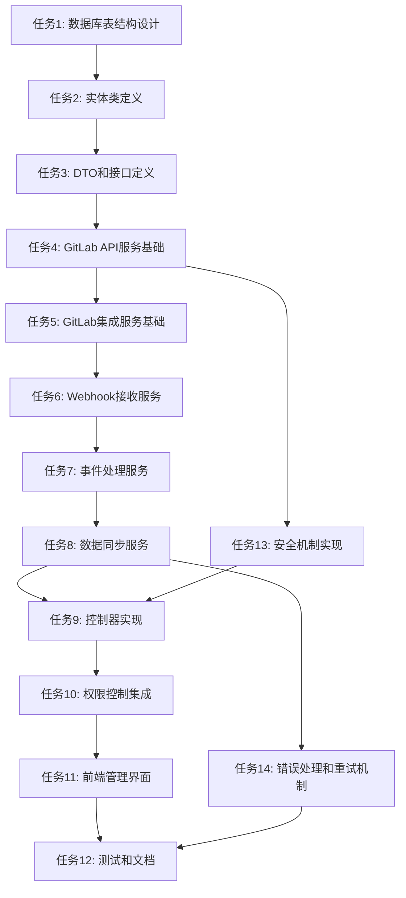

# GitLab集成功能 - 原子化任务拆分

## 任务依赖图

## 原子任务详细定义

### 任务1: 数据库表结构设计
**输入契约:**
- 现有数据库schema
- GitLab集成需求规范
- 性能和安全要求

**输出契约:**
- 完整的SQL建表语句
- 索引设计
- 外键约束
- 数据迁移脚本

**实现约束:**
- 使用MySQL 8语法
- 遵循现有命名规范
- 支持软删除
- 包含审计字段

**依赖关系:**
- 前置: 无
- 后置: 任务2

### 任务2: 实体类定义
**输入契约:**
- 数据库表结构
- TypeORM装饰器规范
- 现有实体类模式

**输出契约:**
- GitLabInstance实体类
- GitLabProjectMapping实体类
- GitLabEventLog实体类
- 实体关系定义

**实现约束:**
- 使用TypeORM装饰器
- 遵循现有实体类结构
- 包含验证规则
- 支持序列化

**依赖关系:**
- 前置: 任务1
- 后置: 任务3

### 任务3: DTO和接口定义
**输入契约:**
- 实体类定义
- API设计规范
- 现有DTO模式

**输出契约:**
- 创建和更新DTO类
- 响应接口定义
- 验证装饰器
- 类型定义文件

**实现约束:**
- 使用class-validator
- 遵循现有DTO模式
- 包含完整验证规则
- 支持文档生成

**依赖关系:**
- 前置: 任务2
- 后置: 任务4

### 任务4: GitLab API服务基础
**输入契约:**
- DTO和接口定义
- GitLab API文档
- HTTP客户端配置

**输出契约:**
- GitLabApiService类
- API调用方法
- 错误处理机制
- 连接测试功能

**实现约束:**
- 使用NestJS HttpModule
- 支持多实例配置
- 包含重试机制
- 支持认证

**依赖关系:**
- 前置: 任务3
- 后置: 任务5, 任务13

### 任务5: GitLab集成服务基础
**输入契约:**
- GitLab API服务
- 实体类定义
- 现有服务模式

**输出契约:**
- GitLabIntegrationService类
- 实例管理方法
- 项目映射管理方法
- 基础CRUD操作

**实现约束:**
- 使用NestJS服务模式
- 支持事务处理
- 包含日志记录
- 支持缓存

**依赖关系:**
- 前置: 任务4
- 后置: 任务6

### 任务6: Webhook接收服务
**输入契约:**
- GitLab集成服务
- Webhook事件规范
- 签名验证要求

**输出契约:**
- GitLabWebhookService类
- 签名验证方法
- 事件解析方法
- 基础事件处理

**实现约束:**
- 使用NestJS控制器
- 支持HMAC-SHA256验证
- 包含错误处理
- 支持异步处理

**依赖关系:**
- 前置: 任务5
- 后置: 任务7

### 任务7: 事件处理服务
**输入契约:**
- Webhook接收服务
- 事件类型定义
- 业务逻辑要求

**输出契约:**
- 事件处理器类
- 事件路由机制
- 事件验证方法
- 事件日志记录

**实现约束:**
- 使用策略模式
- 支持事件去重
- 包含错误处理
- 支持重试机制

**依赖关系:**
- 前置: 任务6
- 后置: 任务8

### 任务8: 数据同步服务
**输入契约:**
- 事件处理服务
- 现有Issue和Project服务
- 数据映射规则

**输出契约:**
- GitLabSyncService类
- 数据同步方法
- 状态映射方法
- 冲突解决机制

**实现约束:**
- 使用现有服务接口
- 支持增量同步
- 包含数据验证
- 支持回滚

**依赖关系:**
- 前置: 任务7
- 后置: 任务9, 任务14

### 任务9: 控制器实现
**输入契约:**
- 所有服务类
- API设计规范
- 权限控制要求

**输出契约:**
- GitLabIntegrationController类
- ProjectMappingController类
- GitLabWebhookController类
- 完整的API端点

**实现约束:**
- 使用NestJS控制器
- 包含权限装饰器
- 支持参数验证
- 包含错误处理

**依赖关系:**
- 前置: 任务8, 任务13
- 后置: 任务10

### 任务10: 权限控制集成
**输入契约:**
- 控制器实现
- 现有权限系统
- 角色定义

**输出契约:**
- 权限装饰器配置
- 角色验证逻辑
- 访问控制规则
- 权限测试用例

**实现约束:**
- 使用现有权限系统
- 支持角色继承
- 包含权限检查
- 支持动态权限

**依赖关系:**
- 前置: 任务9
- 后置: 任务11

### 任务11: 前端管理界面
**输入契约:**
- 控制器API
- 现有前端架构
- UI设计规范

**输出契约:**
- 集成管理页面
- 项目配置页面
- 状态监控页面
- 响应式设计

**实现约束:**
- 使用Vue3 + Ant Design
- 遵循现有组件模式
- 支持国际化
- 包含错误处理

**依赖关系:**
- 前置: 任务10
- 后置: 任务12

### 任务12: 测试和文档
**输入契约:**
- 所有功能实现
- 测试框架配置
- 文档模板

**输出契约:**
- 单元测试用例
- 集成测试用例
- API文档
- 用户手册

**实现约束:**
- 使用Jest测试框架
- 包含Playwright E2E测试
- 支持测试覆盖率
- 包含性能测试

**依赖关系:**
- 前置: 任务11, 任务14
- 后置: 无

### 任务13: 安全机制实现
**输入契约:**
- GitLab API服务
- 安全要求规范
- 加密库配置

**输出契约:**
- 加密解密服务
- 签名验证方法
- 安全配置管理
- 安全测试用例

**实现约束:**
- 使用Node.js crypto模块
- 支持AES加密
- 包含HMAC验证
- 支持密钥轮换

**依赖关系:**
- 前置: 任务4
- 后置: 任务9

### 任务14: 错误处理和重试机制
**输入契约:**
- 数据同步服务
- 错误处理规范
- 重试策略要求

**输出契约:**
- 错误处理服务
- 重试机制实现
- 死信队列处理
- 监控告警

**实现约束:**
- 使用指数退避算法
- 支持重试次数限制
- 包含错误分类
- 支持告警通知

**依赖关系:**
- 前置: 任务8
- 后置: 任务12

## 任务复杂度评估

### 高复杂度任务 (8-10分)
- 任务8: 数据同步服务 - 涉及复杂的数据映射和冲突解决
- 任务11: 前端管理界面 - 需要完整的UI设计和交互逻辑

### 中复杂度任务 (5-7分)
- 任务4: GitLab API服务基础 - 需要处理多种API调用和错误情况
- 任务7: 事件处理服务 - 需要设计灵活的事件处理机制
- 任务9: 控制器实现 - 需要实现完整的API端点

### 低复杂度任务 (1-4分)
- 任务1: 数据库表结构设计 - 相对简单的表结构设计
- 任务2: 实体类定义 - 基于现有模式的实体类
- 任务3: DTO和接口定义 - 标准的数据传输对象定义

## 验收标准

### 每个任务的通用验收标准
- [ ] 代码编译通过
- [ ] 单元测试通过
- [ ] 代码规范检查通过
- [ ] 文档更新完成
- [ ] 功能验证通过

### 特定任务的验收标准
- **任务1**: 数据库迁移脚本可执行，表结构符合设计
- **任务2**: 实体类通过TypeORM验证，关系定义正确
- **任务3**: DTO验证规则完整，接口定义清晰
- **任务4**: API调用成功，错误处理完善
- **任务5**: 服务方法完整，事务处理正确
- **任务6**: Webhook接收正常，签名验证有效
- **任务7**: 事件处理正确，路由机制有效
- **任务8**: 数据同步准确，冲突解决有效
- **任务9**: API端点完整，权限控制有效
- **任务10**: 权限验证正确，访问控制有效
- **任务11**: 界面功能完整，用户体验良好
- **任务12**: 测试覆盖率高，文档完整
- **任务13**: 安全机制有效，加密解密正确
- **任务14**: 错误处理完善，重试机制有效

## 风险控制

### 高风险任务
- 任务8: 数据同步服务 - 可能影响现有数据
- 任务11: 前端管理界面 - 可能影响用户体验

### 风险缓解措施
- 充分测试数据同步逻辑
- 使用事务确保数据一致性
- 提供数据回滚机制
- 分阶段发布前端功能
- 提供功能开关控制

### 质量保证
- 每个任务完成后进行代码审查
- 关键任务进行结对编程
- 定期进行集成测试
- 持续监控系统性能
- 及时修复发现的问题

任务拆分完成，可以进入APPROVE阶段进行审批。
