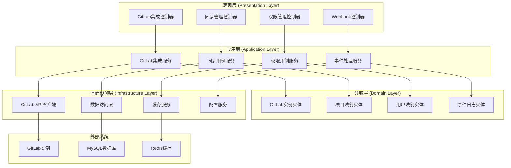
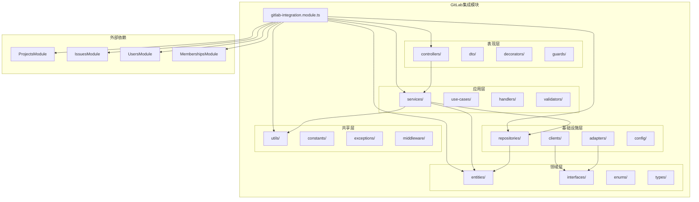
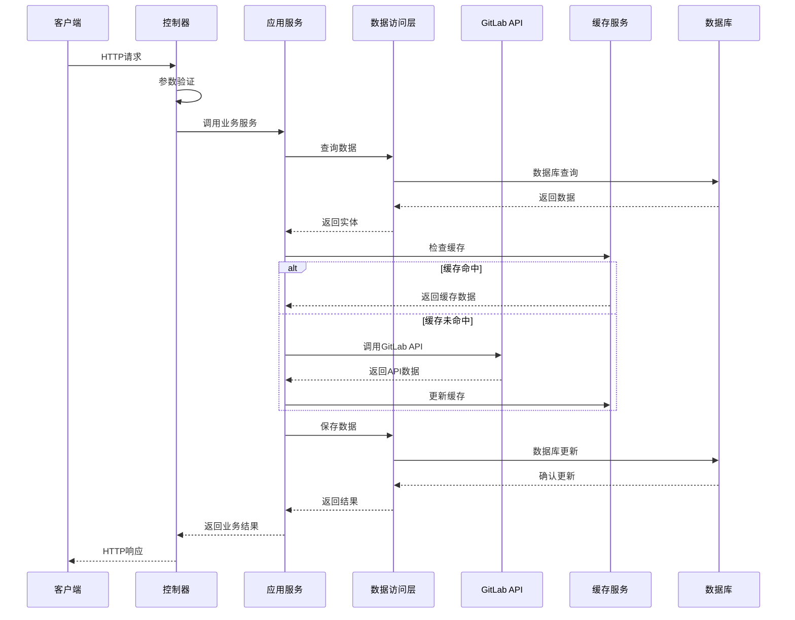

# GitLab集成功能重构 - 设计文档

## 整体架构图



## 分层设计和核心组件

### 1. 表现层 (Presentation Layer)

#### 控制器组件
- **GitLabIntegrationController**: 集成管理API
- **GitLabSyncManagementController**: 同步管理API
- **GitLabPermissionsController**: 权限管理API
- **GitLabWebhookController**: Webhook处理API

#### 职责
- 接收HTTP请求
- 参数验证和转换
- 调用应用服务
- 返回统一响应格式

### 2. 应用层 (Application Layer)

#### 服务组件
- **GitLabIntegrationService**: 集成管理服务
- **GitLabSyncUseCase**: 同步用例服务
- **GitLabPermissionsUseCase**: 权限用例服务
- **GitLabEventProcessor**: 事件处理服务

#### 职责
- 业务逻辑处理
- 用例编排
- 事务管理
- 事件发布

### 3. 领域层 (Domain Layer)

#### 实体组件
- **GitLabInstance**: GitLab实例实体
- **GitLabProjectMapping**: 项目映射实体
- **GitLabUserMapping**: 用户映射实体
- **GitLabEventLog**: 事件日志实体

#### 职责
- 业务规则定义
- 数据模型定义
- 领域服务

### 4. 基础设施层 (Infrastructure Layer)

#### 组件
- **GitLabApiClient**: GitLab API客户端
- **GitLabRepository**: 数据访问层
- **GitLabCacheService**: 缓存服务
- **GitLabConfigService**: 配置服务

#### 职责
- 外部系统集成
- 数据持久化
- 缓存管理
- 配置管理

## 模块依赖关系图



## 接口契约定义

### 1. 应用服务接口

```typescript
// GitLab集成服务接口
export interface IGitLabIntegrationService {
  // 实例管理
  createInstance(dto: CreateGitLabInstanceDto): Promise<GitLabInstanceResponseDto>;
  updateInstance(id: string, dto: UpdateGitLabInstanceDto): Promise<GitLabInstanceResponseDto>;
  deleteInstance(id: string): Promise<void>;
  getInstance(id: string): Promise<GitLabInstanceResponseDto>;
  listInstances(): Promise<GitLabInstanceResponseDto[]>;
  
  // 项目映射管理
  createProjectMapping(dto: CreateProjectMappingDto): Promise<ProjectMappingResponseDto>;
  updateProjectMapping(id: string, dto: UpdateProjectMappingDto): Promise<ProjectMappingResponseDto>;
  deleteProjectMapping(id: string): Promise<void>;
  getProjectMapping(id: string): Promise<ProjectMappingResponseDto>;
  listProjectMappings(instanceId?: string): Promise<ProjectMappingResponseDto[]>;
}

// 同步用例服务接口
export interface IGitLabSyncUseCase {
  // 同步执行
  executeIncrementalSync(instanceId: string): Promise<SyncResult>;
  executeFullSync(instanceId: string): Promise<SyncResult>;
  executeUserSync(instanceId: string): Promise<SyncResult>;
  
  // 同步状态
  getSyncStatus(instanceId: string): Promise<SyncStatus>;
  getSyncHistory(instanceId: string, limit?: number): Promise<SyncHistory[]>;
}

// 权限用例服务接口
export interface IGitLabPermissionsUseCase {
  // 权限检查
  checkInstancePermissions(instanceId: string, userId: string): Promise<boolean>;
  checkProjectPermissions(projectId: string, userId: string): Promise<boolean>;
  
  // 权限管理
  grantInstanceAccess(instanceId: string, userId: string): Promise<void>;
  revokeInstanceAccess(instanceId: string, userId: string): Promise<void>;
}
```

### 2. 数据访问接口

```typescript
// GitLab实例仓储接口
export interface IGitLabInstanceRepository {
  findById(id: string): Promise<GitLabInstance | null>;
  findAll(): Promise<GitLabInstance[]>;
  findByBaseUrl(baseUrl: string): Promise<GitLabInstance | null>;
  save(instance: GitLabInstance): Promise<GitLabInstance>;
  update(id: string, instance: Partial<GitLabInstance>): Promise<GitLabInstance>;
  delete(id: string): Promise<void>;
}

// GitLab项目映射仓储接口
export interface IGitLabProjectMappingRepository {
  findById(id: string): Promise<GitLabProjectMapping | null>;
  findByInstanceId(instanceId: string): Promise<GitLabProjectMapping[]>;
  findByProjectId(projectId: string): Promise<GitLabProjectMapping | null>;
  save(mapping: GitLabProjectMapping): Promise<GitLabProjectMapping>;
  update(id: string, mapping: Partial<GitLabProjectMapping>): Promise<GitLabProjectMapping>;
  delete(id: string): Promise<void>;
}
```

### 3. 外部服务接口

```typescript
// GitLab API客户端接口
export interface IGitLabApiClient {
  // 连接测试
  testConnection(instance: GitLabInstance): Promise<boolean>;
  
  // 实例信息
  getInstanceInfo(instance: GitLabInstance): Promise<GitLabInstanceInfo>;
  
  // 项目管理
  getProjects(instance: GitLabInstance, options?: GetProjectsOptions): Promise<GitLabProject[]>;
  getProject(instance: GitLabInstance, projectId: string): Promise<GitLabProject>;
  
  // 用户管理
  getUsers(instance: GitLabInstance, options?: GetUsersOptions): Promise<GitLabUser[]>;
  getUser(instance: GitLabInstance, userId: string): Promise<GitLabUser>;
  
  // 问题管理
  getIssues(instance: GitLabInstance, projectId: string, options?: GetIssuesOptions): Promise<GitLabIssue[]>;
  getIssue(instance: GitLabInstance, projectId: string, issueId: string): Promise<GitLabIssue>;
}

// 缓存服务接口
export interface ICacheService {
  get<T>(key: string): Promise<T | null>;
  set<T>(key: string, value: T, ttl?: number): Promise<void>;
  delete(key: string): Promise<void>;
  clear(): Promise<void>;
  exists(key: string): Promise<boolean>;
}
```

## 数据流向图



## 异常处理策略

### 1. 异常分类

```typescript
// 基础异常类
export abstract class GitLabIntegrationException extends HttpException {
  abstract readonly errorCode: string;
  abstract readonly statusCode: HttpStatus;
}

// 业务异常
export class GitLabInstanceNotFoundException extends GitLabIntegrationException {
  readonly errorCode = 'GITLAB_INSTANCE_NOT_FOUND';
  readonly statusCode = HttpStatus.NOT_FOUND;
}

export class GitLabApiException extends GitLabIntegrationException {
  readonly errorCode = 'GITLAB_API_ERROR';
  readonly statusCode = HttpStatus.BAD_GATEWAY;
}

export class GitLabSyncException extends GitLabIntegrationException {
  readonly errorCode = 'GITLAB_SYNC_ERROR';
  readonly statusCode = HttpStatus.INTERNAL_SERVER_ERROR;
}

// 验证异常
export class GitLabValidationException extends GitLabIntegrationException {
  readonly errorCode = 'GITLAB_VALIDATION_ERROR';
  readonly statusCode = HttpStatus.BAD_REQUEST;
}
```

### 2. 异常处理中间件

```typescript
@Catch(GitLabIntegrationException)
export class GitLabExceptionFilter implements ExceptionFilter {
  catch(exception: GitLabIntegrationException, host: ArgumentsHost) {
    const ctx = host.switchToHttp();
    const response = ctx.getResponse();
    const request = ctx.getRequest();
    
    const errorResponse: ErrorResponseDto = {
      errorCode: exception.errorCode,
      message: exception.message,
      timestamp: new Date(),
      path: request.url,
    };
    
    response.status(exception.statusCode).json(errorResponse);
  }
}
```

### 3. 错误码管理

```typescript
export enum GitLabErrorCodes {
  // 实例相关
  INSTANCE_NOT_FOUND = 'GITLAB_INSTANCE_NOT_FOUND',
  INSTANCE_ALREADY_EXISTS = 'GITLAB_INSTANCE_ALREADY_EXISTS',
  INSTANCE_INVALID_CONFIG = 'GITLAB_INSTANCE_INVALID_CONFIG',
  
  // API相关
  API_CONNECTION_FAILED = 'GITLAB_API_CONNECTION_FAILED',
  API_AUTHENTICATION_FAILED = 'GITLAB_API_AUTHENTICATION_FAILED',
  API_RATE_LIMITED = 'GITLAB_API_RATE_LIMITED',
  
  // 同步相关
  SYNC_IN_PROGRESS = 'GITLAB_SYNC_IN_PROGRESS',
  SYNC_FAILED = 'GITLAB_SYNC_FAILED',
  SYNC_TIMEOUT = 'GITLAB_SYNC_TIMEOUT',
  
  // 权限相关
  PERMISSION_DENIED = 'GITLAB_PERMISSION_DENIED',
  INSUFFICIENT_PERMISSIONS = 'GITLAB_INSUFFICIENT_PERMISSIONS',
}
```

## 配置管理

### 1. 配置接口

```typescript
export interface GitLabConfig {
  api: {
    timeout: number;
    maxRetries: number;
    retryDelay: number;
  };
  cache: {
    enabled: boolean;
    ttl: number;
    maxSize: number;
  };
  sync: {
    batchSize: number;
    concurrency: number;
    timeout: number;
  };
  webhook: {
    secret: string;
    timeout: number;
  };
}
```

### 2. 配置服务

```typescript
@Injectable()
export class GitLabConfigService {
  constructor(private configService: ConfigService) {}
  
  getApiTimeout(): number {
    return this.configService.get<number>('GITLAB_API_TIMEOUT', 30000);
  }
  
  getCacheConfig(): CacheConfig {
    return {
      enabled: this.configService.get<boolean>('GITLAB_CACHE_ENABLED', true),
      ttl: this.configService.get<number>('GITLAB_CACHE_TTL', 3600),
      maxSize: this.configService.get<number>('GITLAB_CACHE_MAX_SIZE', 1000),
    };
  }
}
```

## 缓存策略

### 1. 缓存键设计

```typescript
export class GitLabCacheKeys {
  static instance(id: string): string {
    return `gitlab:instance:${id}`;
  }
  
  static projects(instanceId: string): string {
    return `gitlab:projects:${instanceId}`;
  }
  
  static users(instanceId: string): string {
    return `gitlab:users:${instanceId}`;
  }
  
  static syncStatus(instanceId: string): string {
    return `gitlab:sync:status:${instanceId}`;
  }
}
```

### 2. 缓存服务实现

```typescript
@Injectable()
export class GitLabCacheService implements ICacheService {
  constructor(
    private cacheManager: Cache,
    private configService: GitLabConfigService,
  ) {}
  
  async get<T>(key: string): Promise<T | null> {
    if (!this.configService.getCacheConfig().enabled) {
      return null;
    }
    
    return await this.cacheManager.get<T>(key);
  }
  
  async set<T>(key: string, value: T, ttl?: number): Promise<void> {
    if (!this.configService.getCacheConfig().enabled) {
      return;
    }
    
    const cacheTtl = ttl || this.configService.getCacheConfig().ttl;
    await this.cacheManager.set(key, value, cacheTtl);
  }
}
```

## 性能优化策略

### 1. 异步处理

```typescript
@Injectable()
export class GitLabSyncService {
  constructor(
    private eventEmitter: EventEmitter2,
    private logger: Logger,
  ) {}
  
  async executeSync(instanceId: string, type: SyncType): Promise<void> {
    // 异步执行同步任务
    setImmediate(async () => {
      try {
        await this.performSync(instanceId, type);
        this.eventEmitter.emit('sync.completed', { instanceId, type });
      } catch (error) {
        this.logger.error('Sync failed', error);
        this.eventEmitter.emit('sync.failed', { instanceId, type, error });
      }
    });
  }
}
```

### 2. 批量处理

```typescript
@Injectable()
export class GitLabBatchProcessor {
  async processBatch<T>(
    items: T[],
    processor: (item: T) => Promise<void>,
    batchSize: number = 10,
  ): Promise<void> {
    const batches = this.chunkArray(items, batchSize);
    
    for (const batch of batches) {
      await Promise.all(batch.map(processor));
    }
  }
  
  private chunkArray<T>(array: T[], size: number): T[][] {
    const chunks: T[][] = [];
    for (let i = 0; i < array.length; i += size) {
      chunks.push(array.slice(i, i + size));
    }
    return chunks;
  }
}
```

### 3. 请求限流

```typescript
@Injectable()
export class GitLabRateLimiter {
  private readonly rateLimits = new Map<string, RateLimitInfo>();
  
  async checkRateLimit(instanceId: string): Promise<boolean> {
    const limit = this.rateLimits.get(instanceId);
    const now = Date.now();
    
    if (!limit || now - limit.resetTime > 60000) {
      this.rateLimits.set(instanceId, {
        count: 1,
        resetTime: now,
      });
      return true;
    }
    
    if (limit.count >= 100) { // 每分钟100次请求
      return false;
    }
    
    limit.count++;
    return true;
  }
}
```

## 监控和日志

### 1. 日志策略

```typescript
@Injectable()
export class GitLabLogger {
  private readonly logger = new Logger('GitLabIntegration');
  
  logApiCall(instanceId: string, method: string, url: string, duration: number): void {
    this.logger.log(`API Call: ${method} ${url} - ${duration}ms`, {
      instanceId,
      method,
      url,
      duration,
    });
  }
  
  logSyncEvent(instanceId: string, event: string, data: any): void {
    this.logger.log(`Sync Event: ${event}`, {
      instanceId,
      event,
      data,
    });
  }
}
```

### 2. 性能监控

```typescript
@Injectable()
export class GitLabMetrics {
  private readonly metrics = new Map<string, number>();
  
  recordApiCall(instanceId: string, duration: number): void {
    const key = `api.call.${instanceId}`;
    this.metrics.set(key, (this.metrics.get(key) || 0) + 1);
  }
  
  recordSyncDuration(instanceId: string, duration: number): void {
    const key = `sync.duration.${instanceId}`;
    this.metrics.set(key, duration);
  }
}
```

## 总结

本设计文档定义了GitLab集成功能重构的完整架构，包括：

1. **清晰的分层架构**: 表现层、应用层、领域层、基础设施层
2. **统一的设计模式**: 工厂模式、策略模式、观察者模式、Repository模式
3. **完善的异常处理**: 分类异常、统一处理、错误码管理
4. **高效的缓存策略**: 多级缓存、智能失效、性能优化
5. **全面的监控日志**: 结构化日志、性能监控、错误追踪

该架构设计确保了代码的可维护性、可扩展性和高性能，同时保持了与现有系统的兼容性。
