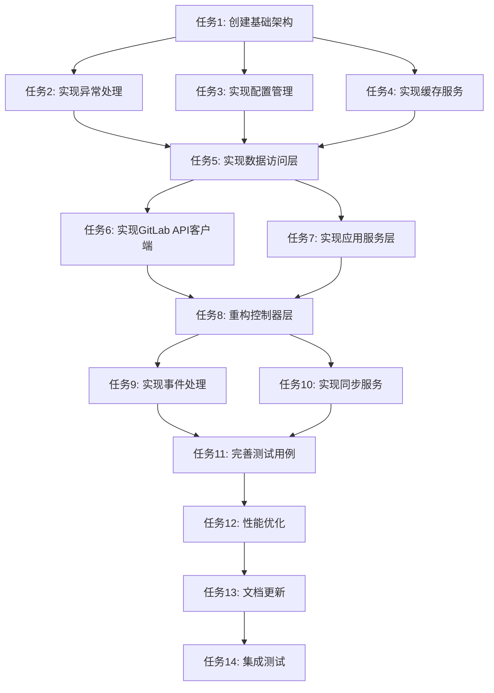

# GitLab集成功能重构 - 任务拆分文档

## 任务依赖图

## 原子任务详细说明

### 任务1: 创建基础架构
**优先级**: 高  
**复杂度**: 中等  
**预估时间**: 4小时

#### 输入契约
- 现有GitLab集成模块代码
- 设计文档中的架构定义

#### 输出契约
- 新的目录结构
- 基础接口定义
- 枚举和类型定义
- 常量定义

#### 实现约束
- 保持现有功能不变
- 遵循NestJS模块规范
- 使用TypeScript严格模式

#### 具体任务
1. 创建新的目录结构
   - `core/` - 核心层
   - `infrastructure/` - 基础设施层
   - `application/` - 应用层
   - `presentation/` - 表现层
   - `shared/` - 共享层

2. 定义基础接口
   - `IGitLabIntegrationService`
   - `IGitLabSyncUseCase`
   - `IGitLabPermissionsUseCase`
   - `IGitLabInstanceRepository`
   - `IGitLabProjectMappingRepository`

3. 创建枚举定义
   - `SyncType`
   - `InstanceType`
   - `EventType`
   - `PermissionType`

4. 创建类型定义
   - `SyncResult`
   - `SyncStatus`
   - `CacheConfig`
   - `ApiConfig`

#### 验收标准
- [ ] 目录结构创建完成
- [ ] 所有接口定义完成
- [ ] 枚举和类型定义完成
- [ ] 代码通过TypeScript编译
- [ ] 通过ESLint检查

---

### 任务2: 实现异常处理
**优先级**: 高  
**复杂度**: 低  
**预估时间**: 2小时

#### 输入契约
- 任务1完成的基础架构
- 设计文档中的异常处理策略

#### 输出契约
- 自定义异常类
- 异常过滤器
- 错误码枚举
- 错误响应DTO

#### 实现约束
- 继承HttpException
- 使用装饰器模式
- 支持国际化

#### 具体任务
1. 创建异常类
   - `GitLabIntegrationException` (基础异常)
   - `GitLabInstanceNotFoundException`
   - `GitLabApiException`
   - `GitLabSyncException`
   - `GitLabValidationException`

2. 实现异常过滤器
   - `GitLabExceptionFilter`
   - 统一错误响应格式
   - 错误日志记录

3. 创建错误码管理
   - `GitLabErrorCodes` 枚举
   - 错误码映射
   - 错误消息国际化

4. 创建错误响应DTO
   - `ErrorResponseDto`
   - 错误详情结构
   - 时间戳和路径信息

#### 验收标准
- [ ] 所有异常类实现完成
- [ ] 异常过滤器工作正常
- [ ] 错误码枚举完整
- [ ] 错误响应格式统一
- [ ] 单元测试通过

---

### 任务3: 实现配置管理
**优先级**: 高  
**复杂度**: 低  
**预估时间**: 2小时

#### 输入契约
- 任务1完成的基础架构
- 现有配置管理方式

#### 输出契约
- 配置服务类
- 配置接口定义
- 环境变量管理
- 配置验证

#### 实现约束
- 使用NestJS ConfigService
- 支持环境变量
- 提供默认值

#### 具体任务
1. 创建配置接口
   - `GitLabConfig` 接口
   - 配置项类型定义
   - 配置验证规则

2. 实现配置服务
   - `GitLabConfigService`
   - 配置项获取方法
   - 配置验证逻辑

3. 环境变量管理
   - 配置环境变量
   - 默认值设置
   - 配置覆盖机制

4. 配置验证
   - 必填项检查
   - 格式验证
   - 范围验证

#### 验收标准
- [ ] 配置服务实现完成
- [ ] 环境变量管理正常
- [ ] 配置验证工作正常
- [ ] 默认值设置正确
- [ ] 单元测试通过

---

### 任务4: 实现缓存服务
**优先级**: 中  
**复杂度**: 中等  
**预估时间**: 3小时

#### 输入契约
- 任务1完成的基础架构
- 任务3完成的配置管理

#### 输出契约
- 缓存服务接口
- 缓存服务实现
- 缓存键管理
- 缓存策略

#### 实现约束
- 使用NestJS CacheManager
- 支持TTL设置
- 支持缓存失效

#### 具体任务
1. 创建缓存接口
   - `ICacheService` 接口
   - 缓存操作方法
   - 缓存配置接口

2. 实现缓存服务
   - `GitLabCacheService`
   - 缓存操作实现
   - 缓存配置管理

3. 缓存键管理
   - `GitLabCacheKeys` 类
   - 键名生成规则
   - 键名验证

4. 缓存策略
   - 缓存失效策略
   - 缓存更新策略
   - 缓存清理策略

#### 验收标准
- [ ] 缓存服务实现完成
- [ ] 缓存键管理正常
- [ ] 缓存策略工作正常
- [ ] 性能测试通过
- [ ] 单元测试通过

---

### 任务5: 实现数据访问层
**优先级**: 高  
**复杂度**: 中等  
**预估时间**: 4小时

#### 输入契约
- 任务1完成的基础架构
- 任务2完成的异常处理
- 现有实体定义

#### 输出契约
- Repository接口
- Repository实现
- 数据访问封装
- 事务管理

#### 实现约束
- 使用TypeORM
- 遵循Repository模式
- 支持事务

#### 具体任务
1. 创建Repository接口
   - `IGitLabInstanceRepository`
   - `IGitLabProjectMappingRepository`
   - `IGitLabUserMappingRepository`
   - `IGitLabEventLogRepository`

2. 实现Repository类
   - `GitLabInstanceRepository`
   - `GitLabProjectMappingRepository`
   - `GitLabUserMappingRepository`
   - `GitLabEventLogRepository`

3. 数据访问封装
   - 查询方法封装
   - 更新方法封装
   - 删除方法封装

4. 事务管理
   - 事务装饰器
   - 事务回滚
   - 事务传播

#### 验收标准
- [ ] Repository接口定义完成
- [ ] Repository实现完成
- [ ] 数据访问封装正常
- [ ] 事务管理工作正常
- [ ] 单元测试通过

---

### 任务6: 实现GitLab API客户端
**优先级**: 高  
**复杂度**: 高  
**预估时间**: 6小时

#### 输入契约
- 任务1完成的基础架构
- 任务2完成的异常处理
- 任务3完成的配置管理
- 现有GitLab API服务

#### 输出契约
- API客户端接口
- API客户端实现
- 请求封装
- 响应处理

#### 实现约束
- 使用@gitbeaker/rest
- 支持重试机制
- 支持超时设置

#### 具体任务
1. 创建API客户端接口
   - `IGitLabApiClient` 接口
   - API方法定义
   - 请求选项接口

2. 实现API客户端
   - `GitLabApiClient`
   - API调用实现
   - 错误处理

3. 请求封装
   - 请求参数验证
   - 请求头设置
   - 请求体处理

4. 响应处理
   - 响应数据转换
   - 错误响应处理
   - 分页处理

#### 验收标准
- [ ] API客户端接口定义完成
- [ ] API客户端实现完成
- [ ] 请求封装正常
- [ ] 响应处理正常
- [ ] 集成测试通过

---

### 任务7: 实现应用服务层
**优先级**: 高  
**复杂度**: 高  
**预估时间**: 8小时

#### 输入契约
- 任务1完成的基础架构
- 任务2完成的异常处理
- 任务3完成的配置管理
- 任务4完成的缓存服务
- 任务5完成的数据访问层
- 任务6完成的API客户端

#### 输出契约
- 应用服务实现
- 业务逻辑封装
- 用例服务
- 事件处理

#### 实现约束
- 遵循单一职责原则
- 使用依赖注入
- 支持事务

#### 具体任务
1. 实现集成服务
   - `GitLabIntegrationService`
   - 实例管理逻辑
   - 项目映射管理逻辑

2. 实现同步用例服务
   - `GitLabSyncUseCase`
   - 同步策略实现
   - 同步状态管理

3. 实现权限用例服务
   - `GitLabPermissionsUseCase`
   - 权限检查逻辑
   - 权限管理逻辑

4. 实现事件处理服务
   - `GitLabEventProcessor`
   - 事件处理逻辑
   - 事件发布逻辑

#### 验收标准
- [ ] 应用服务实现完成
- [ ] 业务逻辑封装正常
- [ ] 用例服务工作正常
- [ ] 事件处理正常
- [ ] 单元测试通过

---

### 任务8: 重构控制器层
**优先级**: 高  
**复杂度**: 中等  
**预估时间**: 4小时

#### 输入契约
- 任务1完成的基础架构
- 任务2完成的异常处理
- 任务7完成的应用服务层
- 现有控制器代码

#### 输出契约
- 重构后的控制器
- 统一的响应格式
- 参数验证
- 错误处理

#### 实现约束
- 保持API兼容性
- 使用装饰器验证
- 统一响应格式

#### 具体任务
1. 重构集成控制器
   - `GitLabIntegrationController`
   - 方法拆分
   - 参数验证

2. 重构同步管理控制器
   - `GitLabSyncManagementController`
   - 方法优化
   - 响应格式统一

3. 重构权限控制器
   - `GitLabPermissionsController`
   - 权限检查
   - 响应优化

4. 重构Webhook控制器
   - `GitLabWebhookController`
   - 事件处理
   - 错误处理

#### 验收标准
- [ ] 控制器重构完成
- [ ] API兼容性保持
- [ ] 响应格式统一
- [ ] 参数验证正常
- [ ] 单元测试通过

---

### 任务9: 实现事件处理
**优先级**: 中  
**复杂度**: 中等  
**预估时间**: 3小时

#### 输入契约
- 任务1完成的基础架构
- 任务7完成的应用服务层
- 现有事件处理代码

#### 输出契约
- 事件处理器
- 事件队列
- 事件去重
- 事件日志

#### 实现约束
- 使用观察者模式
- 支持异步处理
- 支持事件去重

#### 具体任务
1. 实现事件处理器
   - `GitLabEventProcessor`
   - 事件处理逻辑
   - 事件分发

2. 实现事件队列
   - `GitLabEventQueue`
   - 队列管理
   - 队列处理

3. 实现事件去重
   - `GitLabEventDeduplication`
   - 去重逻辑
   - 去重策略

4. 实现事件日志
   - 事件记录
   - 事件追踪
   - 事件统计

#### 验收标准
- [ ] 事件处理器实现完成
- [ ] 事件队列工作正常
- [ ] 事件去重正常
- [ ] 事件日志记录正常
- [ ] 单元测试通过

---

### 任务10: 实现同步服务
**优先级**: 高  
**复杂度**: 高  
**预估时间**: 6小时

#### 输入契约
- 任务1完成的基础架构
- 任务6完成的API客户端
- 任务7完成的应用服务层
- 现有同步服务代码

#### 输出契约
- 同步服务实现
- 同步策略
- 同步状态管理
- 同步日志

#### 实现约束
- 支持增量同步
- 支持全量同步
- 支持异步处理

#### 具体任务
1. 实现同步服务
   - `GitLabSyncService`
   - 同步逻辑
   - 同步状态管理

2. 实现同步策略
   - `IncrementalSyncStrategy`
   - `FullSyncStrategy`
   - 策略选择逻辑

3. 实现用户同步
   - `GitLabUserSyncService`
   - 用户同步逻辑
   - 用户映射管理

4. 实现同步日志
   - 同步记录
   - 同步统计
   - 同步监控

#### 验收标准
- [ ] 同步服务实现完成
- [ ] 同步策略工作正常
- [ ] 用户同步正常
- [ ] 同步日志记录正常
- [ ] 集成测试通过

---

### 任务11: 完善测试用例
**优先级**: 高  
**复杂度**: 中等  
**预估时间**: 6小时

#### 输入契约
- 所有任务完成
- 现有测试代码
- 测试框架配置

#### 输出契约
- 单元测试
- 集成测试
- 端到端测试
- 测试覆盖率报告

#### 实现约束
- 使用Jest框架
- 测试覆盖率 > 80%
- 使用Mock对象

#### 具体任务
1. 编写单元测试
   - 服务层测试
   - 控制器测试
   - 工具类测试

2. 编写集成测试
   - API集成测试
   - 数据库集成测试
   - 外部服务集成测试

3. 编写端到端测试
   - 完整流程测试
   - 用户场景测试
   - 性能测试

4. 测试覆盖率
   - 覆盖率统计
   - 覆盖率报告
   - 覆盖率提升

#### 验收标准
- [ ] 单元测试完成
- [ ] 集成测试完成
- [ ] 端到端测试完成
- [ ] 测试覆盖率 > 80%
- [ ] 所有测试通过

---

### 任务12: 性能优化
**优先级**: 中  
**复杂度**: 中等  
**预估时间**: 4小时

#### 输入契约
- 所有任务完成
- 性能测试结果
- 性能监控数据

#### 输出契约
- 性能优化代码
- 性能监控
- 性能报告
- 优化建议

#### 实现约束
- 保持功能不变
- 性能提升 > 20%
- 内存使用优化

#### 具体任务
1. 代码优化
   - 算法优化
   - 数据结构优化
   - 代码重构

2. 缓存优化
   - 缓存策略优化
   - 缓存命中率提升
   - 缓存性能优化

3. 数据库优化
   - 查询优化
   - 索引优化
   - 连接池优化

4. 异步优化
   - 异步处理优化
   - 并发控制
   - 资源管理

#### 验收标准
- [ ] 性能优化完成
- [ ] 性能提升 > 20%
- [ ] 内存使用优化
- [ ] 性能监控正常
- [ ] 性能测试通过

---

### 任务13: 文档更新
**优先级**: 中  
**复杂度**: 低  
**预估时间**: 2小时

#### 输入契约
- 所有任务完成
- 现有文档
- 代码变更

#### 输出契约
- 技术文档
- API文档
- 用户文档
- 部署文档

#### 实现约束
- 文档格式统一
- 内容准确完整
- 易于理解

#### 具体任务
1. 更新技术文档
   - 架构文档
   - 设计文档
   - 实现文档

2. 更新API文档
   - 接口文档
   - 参数说明
   - 示例代码

3. 更新用户文档
   - 使用指南
   - 配置说明
   - 故障排除

4. 更新部署文档
   - 部署指南
   - 配置说明
   - 监控配置

#### 验收标准
- [ ] 技术文档更新完成
- [ ] API文档更新完成
- [ ] 用户文档更新完成
- [ ] 部署文档更新完成
- [ ] 文档质量检查通过

---

### 任务14: 集成测试
**优先级**: 高  
**复杂度**: 中等  
**预估时间**: 3小时

#### 输入契约
- 所有任务完成
- 测试环境准备
- 测试数据准备

#### 输出契约
- 集成测试报告
- 问题修复
- 性能报告
- 兼容性报告

#### 实现约束
- 使用真实环境
- 测试覆盖全面
- 问题及时修复

#### 具体任务
1. 环境准备
   - 测试环境搭建
   - 测试数据准备
   - 测试工具配置

2. 功能测试
   - 完整功能测试
   - 边界条件测试
   - 异常情况测试

3. 性能测试
   - 负载测试
   - 压力测试
   - 稳定性测试

4. 兼容性测试
   - 前端兼容性
   - 数据库兼容性
   - 部署兼容性

#### 验收标准
- [ ] 集成测试完成
- [ ] 所有功能正常
- [ ] 性能指标达标
- [ ] 兼容性良好
- [ ] 问题修复完成

## 任务执行顺序

### 第一阶段: 基础架构 (任务1-4)
- 任务1: 创建基础架构
- 任务2: 实现异常处理
- 任务3: 实现配置管理
- 任务4: 实现缓存服务

### 第二阶段: 数据访问和API (任务5-6)
- 任务5: 实现数据访问层
- 任务6: 实现GitLab API客户端

### 第三阶段: 业务逻辑 (任务7-8)
- 任务7: 实现应用服务层
- 任务8: 重构控制器层

### 第四阶段: 高级功能 (任务9-10)
- 任务9: 实现事件处理
- 任务10: 实现同步服务

### 第五阶段: 测试和优化 (任务11-12)
- 任务11: 完善测试用例
- 任务12: 性能优化

### 第六阶段: 文档和集成 (任务13-14)
- 任务13: 文档更新
- 任务14: 集成测试

## 风险控制

### 高风险任务
- 任务6: 实现GitLab API客户端 (复杂度高)
- 任务7: 实现应用服务层 (复杂度高)
- 任务10: 实现同步服务 (复杂度高)

### 风险缓解措施
1. 充分测试每个任务
2. 保持代码备份
3. 分阶段验证
4. 及时回滚问题代码

### 质量保证
1. 每个任务完成后进行代码审查
2. 运行完整的测试套件
3. 检查代码覆盖率
4. 验证功能完整性
