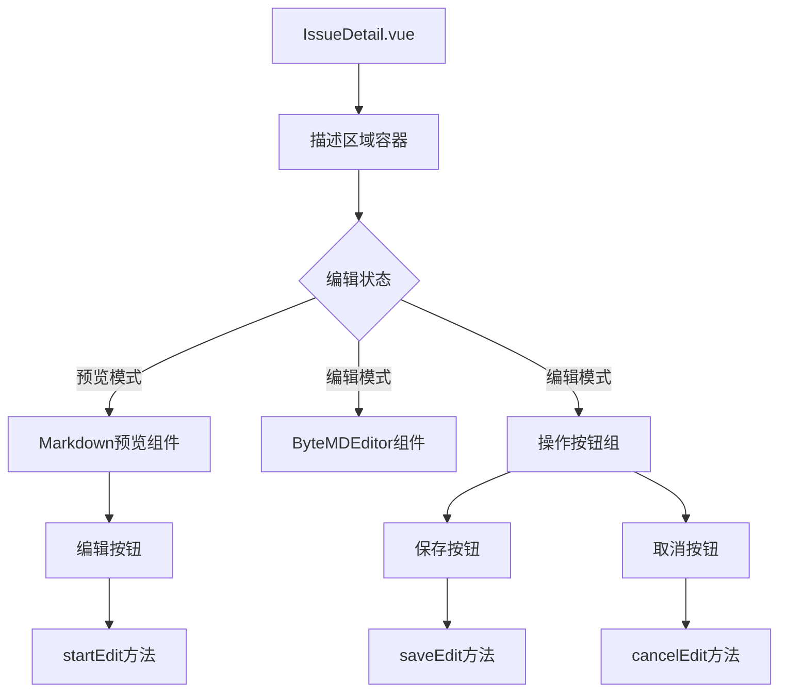
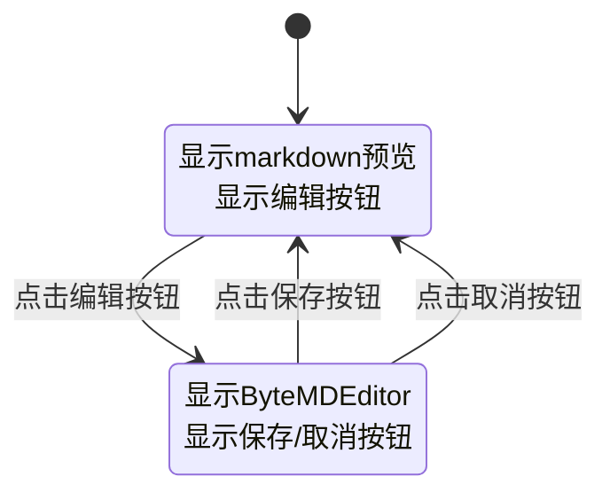
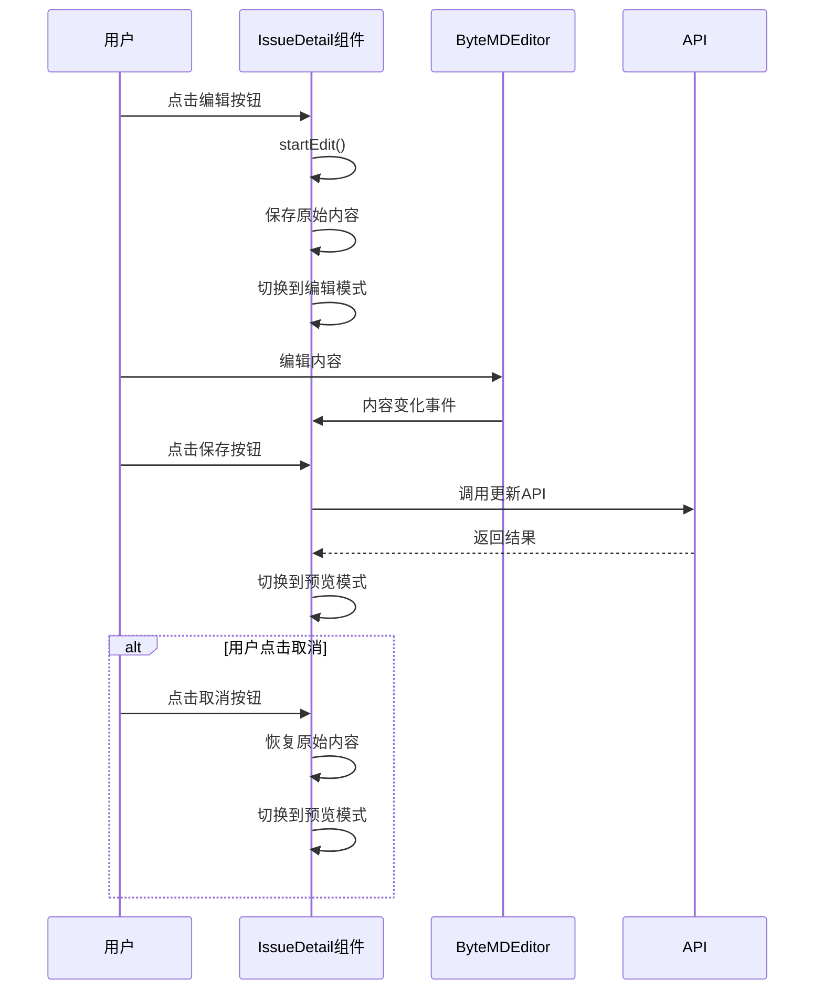

# IssueDetail 优化 - 设计文档

## 整体架构设计

### 组件结构图


### 状态管理设计


## 核心组件设计

### 1. 状态管理
```typescript
// 编辑状态管理
const isEditingDescription = ref(false);
const originalDescription = ref('');
const saving = ref(false);

// 权限控制
const canEditDescription = computed(() => 
  auth.hasAnyRole(['admin', 'project_manager', 'member'])
);
```

### 2. 方法设计
```typescript
// 开始编辑
const startEdit = () => {
  originalDescription.value = issue.value.description;
  isEditingDescription.value = true;
};

// 保存编辑
const saveEdit = async () => {
  saving.value = true;
  try {
    await handleDescriptionChange(issue.value.description);
    isEditingDescription.value = false;
    message.success('描述更新成功');
  } catch (error) {
    message.error('保存失败');
  } finally {
    saving.value = false;
  }
};

// 取消编辑
const cancelEdit = () => {
  issue.value.description = originalDescription.value;
  isEditingDescription.value = false;
};
```

### 3. Markdown 预览组件
```vue
<template>
  <div class="markdown-preview" v-html="renderedMarkdown"></div>
</template>

<script setup>
import { marked } from 'marked';

const renderedMarkdown = computed(() => {
  if (!issue.value.description) {
    return '<p class="empty-content">暂无描述</p>';
  }
  return marked(issue.value.description);
});
</script>
```

## 接口契约定义

### 输入契约
- `issue.value.description`: 当前描述内容
- `canEditDescription`: 编辑权限状态
- `projectId`: 项目ID
- `issueId`: 事项ID

### 输出契约
- 编辑状态切换
- 描述内容更新
- 用户操作反馈

### 异常处理
- 保存失败时保持编辑状态
- 网络错误时显示错误消息
- 权限不足时隐藏编辑按钮

## 数据流向图



## 样式设计规范

### 1. 描述区域容器
```scss
.description-section {
  margin-bottom: 16px;
  
  .description-header {
    display: flex;
    justify-content: space-between;
    align-items: center;
    margin-bottom: 8px;
    
    .description-title {
      font-weight: 500;
      color: #262626;
    }
  }
}
```

### 2. Markdown 预览样式
```scss
.markdown-preview {
  min-height: 100px;
  padding: 12px;
  border: 1px solid #d9d9d9;
  border-radius: 6px;
  background: #fafafa;
  
  .empty-content {
    color: #8c8c8c;
    font-style: italic;
  }
}
```

### 3. 编辑模式样式
```scss
.markdown-editor {
  .editor-actions {
    display: flex;
    justify-content: flex-end;
    gap: 8px;
    margin-top: 12px;
    padding-top: 12px;
    border-top: 1px solid #f0f0f0;
  }
}
```

## 异常处理策略

### 1. 网络错误处理
```typescript
const saveEdit = async () => {
  saving.value = true;
  try {
    await handleDescriptionChange(issue.value.description);
    isEditingDescription.value = false;
    message.success('描述更新成功');
  } catch (error) {
    message.error(error?.response?.data?.message || '保存失败');
    // 保持编辑状态，让用户可以重试
  } finally {
    saving.value = false;
  }
};
```

### 2. 权限控制
```typescript
const canEditDescription = computed(() => {
  return auth.isAuthenticated && 
         auth.hasAnyRole(['admin', 'project_manager', 'member']);
});
```

### 3. 内容验证
```typescript
const saveEdit = async () => {
  if (!issue.value.description?.trim()) {
    message.warning('描述内容不能为空');
    return;
  }
  // ... 保存逻辑
};
```

## 性能优化考虑

### 1. 计算属性缓存
- 使用 `computed` 缓存权限计算结果
- 使用 `computed` 缓存 markdown 渲染结果

### 2. 事件处理优化
- 使用防抖处理内容变化事件
- 避免不必要的重新渲染

### 3. 内存管理
- 及时清理不需要的响应式数据
- 避免内存泄漏
