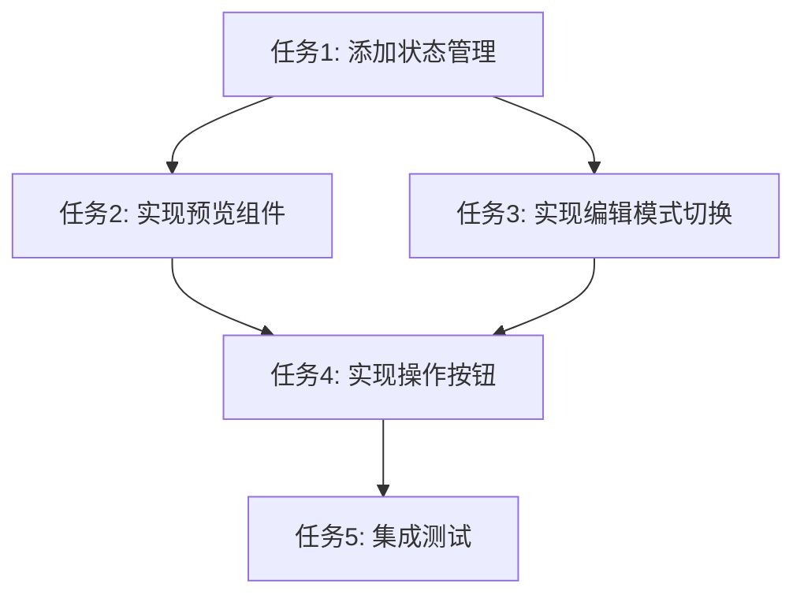

# IssueDetail 优化 - 任务拆分

## 任务依赖图

## 原子任务列表

### 任务1: 添加状态管理
**输入契约:**
- 现有 IssueDetail.vue 文件
- 现有的权限控制逻辑

**输出契约:**
- 添加编辑状态相关的响应式变量
- 添加权限计算属性
- 添加编辑相关的方法框架

**实现约束:**
- 使用 Vue3 Composition API
- 保持现有代码结构
- 遵循项目代码规范

**验收标准:**
- 状态变量正确定义
- 权限计算逻辑正确
- 方法框架完整

### 任务2: 实现预览组件
**输入契约:**
- 任务1完成的状态管理
- markdown 内容数据

**输出契约:**
- 可复用的 markdown 预览组件
- 正确的样式定义
- 空内容处理

**实现约束:**
- 使用 marked 库渲染 markdown
- 样式与 Ant Design 保持一致
- 处理空内容情况

**验收标准:**
- markdown 正确渲染
- 样式美观一致
- 空内容友好显示

### 任务3: 实现编辑模式切换
**输入契约:**
- 任务1的状态管理
- 现有的 ByteMDEditor 组件

**输出契约:**
- 编辑模式切换逻辑
- 原始内容保存机制
- 状态切换方法

**实现约束:**
- 复用现有 ByteMDEditor
- 保持现有 API 调用
- 错误处理完善

**验收标准:**
- 切换逻辑正确
- 内容保存机制可靠
- 错误处理完善

### 任务4: 实现操作按钮
**输入契约:**
- 任务1的状态管理
- 任务3的切换逻辑
- 现有的 API 调用方法

**输出契约:**
- 编辑按钮（预览模式）
- 保存/取消按钮（编辑模式）
- 按钮事件处理

**实现约束:**
- 按钮样式与 Ant Design 一致
- 权限控制正确
- 加载状态处理

**验收标准:**
- 按钮显示正确
- 事件处理完善
- 权限控制有效

### 任务5: 集成测试
**输入契约:**
- 所有任务完成
- 完整的组件实现

**输出契约:**
- 功能测试通过
- 样式测试通过
- 权限测试通过

**实现约束:**
- 测试所有功能路径
- 验证错误处理
- 检查性能表现

**验收标准:**
- 所有功能正常工作
- 样式美观一致
- 性能表现良好

## 并行任务

- 任务2和任务3可以并行执行
- 任务4依赖任务1和任务3完成

## 风险控制

### 高风险任务
- 任务3（编辑模式切换）：涉及状态管理和内容保存
- 任务4（操作按钮）：涉及用户交互和权限控制

### 风险缓解
- 每个任务完成后立即测试
- 保持现有功能不受影响
- 及时处理异常情况
