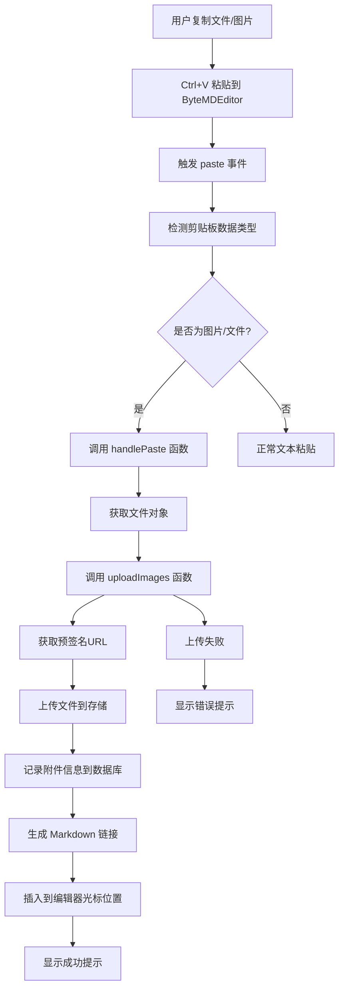
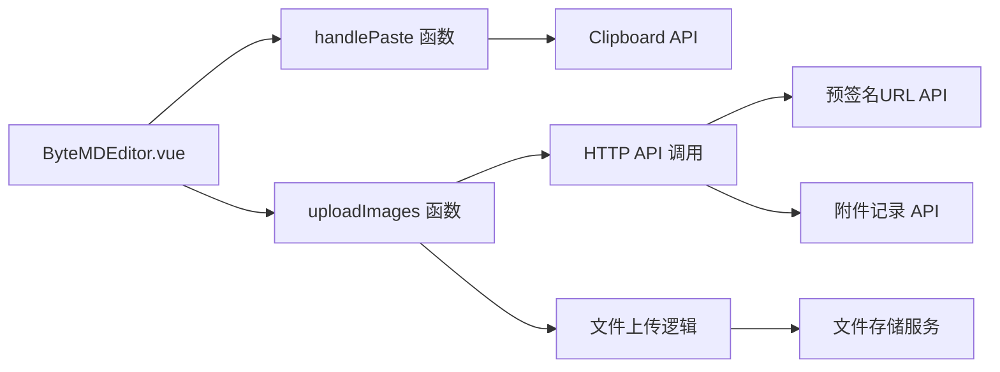
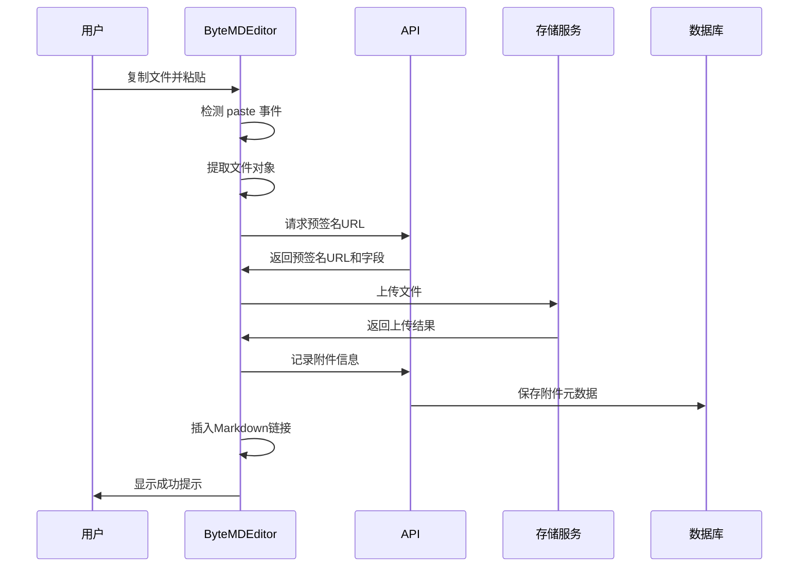

# DESIGN_复制粘贴上传功能

## 整体架构图



## 分层设计和核心组件

### 1. 表示层 (Presentation Layer)
- **ByteMDEditor.vue**: 主编辑器组件
- **事件监听器**: 监听 paste 事件
- **用户反馈**: 进度提示和错误消息

### 2. 业务逻辑层 (Business Logic Layer)
- **handlePaste 函数**: 处理粘贴事件的核心逻辑
- **uploadImages 函数**: 复用现有的文件上传逻辑
- **文件验证**: 文件类型和大小检查

### 3. 数据访问层 (Data Access Layer)
- **HTTP API**: 调用预签名URL和记录附件信息
- **文件存储**: 通过预签名URL直传文件

## 模块依赖关系图



## 接口契约定义

### 1. handlePaste 函数接口
```typescript
interface PasteHandler {
  (event: ClipboardEvent): Promise<void>
}
```

**输入契约**:
- `event: ClipboardEvent` - 粘贴事件对象

**输出契约**:
- 无返回值
- 副作用: 触发文件上传和插入Markdown链接

### 2. uploadImages 函数接口
```typescript
interface UploadImagesHandler {
  (files: File[]): Promise<string[]>
}
```

**输入契约**:
- `files: File[]` - 要上传的文件数组

**输出契约**:
- `Promise<string[]>` - 返回上传后的文件URL数组

## 数据流向图



## 异常处理策略

### 1. 文件类型验证失败
- **处理方式**: 显示错误提示，不执行上传
- **用户反馈**: "不支持的文件类型"

### 2. 文件大小超限
- **处理方式**: 显示错误提示，不执行上传
- **用户反馈**: "文件大小不能超过 10MB"

### 3. 网络上传失败
- **处理方式**: 显示错误提示，不插入链接
- **用户反馈**: "文件上传失败，请重试"

### 4. API调用失败
- **处理方式**: 显示错误提示，不插入链接
- **用户反馈**: "服务暂时不可用，请稍后重试"

## 实现约束

### 1. 技术约束
- 必须使用现有的上传API和存储机制
- 保持与现有编辑器组件的API一致性
- 遵循Vue3 Composition API模式

### 2. 性能约束
- 文件上传不应阻塞编辑器其他功能
- 支持异步上传，不阻塞用户操作
- 合理处理大文件上传的超时问题

### 3. 安全约束
- 文件类型验证防止恶意文件上传
- 文件大小限制防止存储空间滥用
- 使用预签名URL确保上传安全性

## 集成方案

### 1. 与现有组件集成
- 复用 `MarkdownEditor.vue` 和 `SimpleMarkdownEditor.vue` 的粘贴处理逻辑
- 保持相同的用户体验和错误处理方式
- 使用相同的上传API和存储机制

### 2. 与ByteMD编辑器集成
- 在编辑器配置中添加粘贴事件监听
- 利用ByteMD的API在光标位置插入内容
- 保持编辑器的现有功能和样式不变

### 3. 与后端API集成
- 使用现有的 `/attachments/presign` 接口
- 使用现有的 `/attachments/issues/{issueId}/record` 接口
- 保持与现有上传流程的完全兼容
