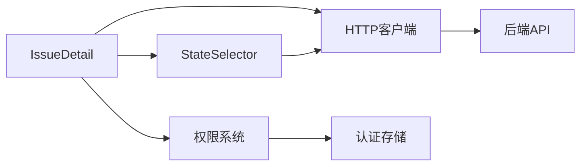
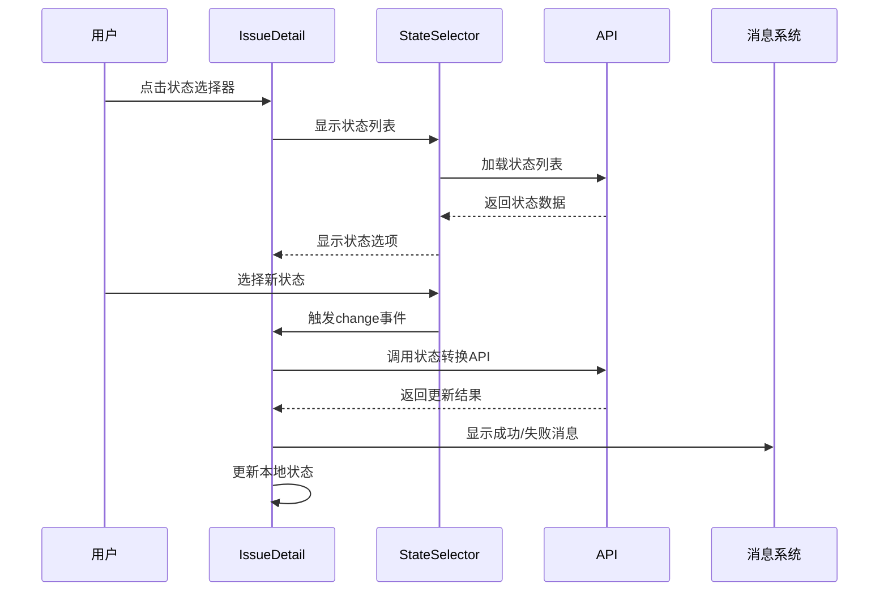

# DESIGN_状态更改功能

## 整体架构图

```mermaid
graph TD
    A[IssueDetail.vue] --> B[StateSelector组件]
    A --> C[权限检查]
    A --> D[状态更改处理]
    
    B --> E[状态列表API]
    B --> F[状态选择事件]
    
    C --> G[canTransition计算属性]
    
    D --> H[changeState方法]
    D --> I[状态更新API]
    D --> J[成功/失败消息]
    
    E --> K[/projects/:id/issues/states/:type]
    I --> L[/projects/:id/issues/:id/transition]
```

## 分层设计和核心组件

### 1. 表示层 (Presentation Layer)
- **IssueDetail.vue**: 主组件，负责状态显示和交互
- **StateSelector.vue**: 状态选择组件，负责状态列表展示和选择

### 2. 业务逻辑层 (Business Logic Layer)
- **权限控制**: 通过canTransition计算属性控制状态更改权限
- **状态管理**: 管理当前状态和可用状态列表
- **事件处理**: 处理状态选择、更改确认等业务逻辑

### 3. 数据访问层 (Data Access Layer)
- **状态列表API**: 获取项目特定类型的状态列表
- **状态转换API**: 执行状态更改操作

## 模块依赖关系图



## 接口契约定义

### StateSelector组件接口
```typescript
interface Props {
  modelValue?: string;           // 当前选中的状态
  projectId: string;            // 项目ID
  issueType: 'requirement' | 'task' | 'bug';  // 事项类型
  placeholder?: string;         // 占位符文本
  disabled?: boolean;           // 是否禁用
  allowClear?: boolean;         // 是否允许清空
}

interface Emits {
  'update:modelValue': [value: string | undefined];
  'change': [value: string | undefined, state: IssueState | undefined];
}
```

### 状态更改处理函数
```typescript
async function handleStateChange(value: string | undefined, state: IssueState | undefined): Promise<void>
```

## 数据流向图



## 异常处理策略

### 1. 网络错误处理
- API调用失败时显示错误消息
- 自动恢复原状态值
- 记录错误日志

### 2. 权限错误处理
- 无权限时禁用状态选择器
- 显示权限提示信息

### 3. 数据验证错误处理
- 状态转换不合法时显示错误消息
- 保持原状态不变

### 4. 用户体验优化
- 状态更改时显示加载状态
- 提供操作确认机制
- 实时反馈操作结果
