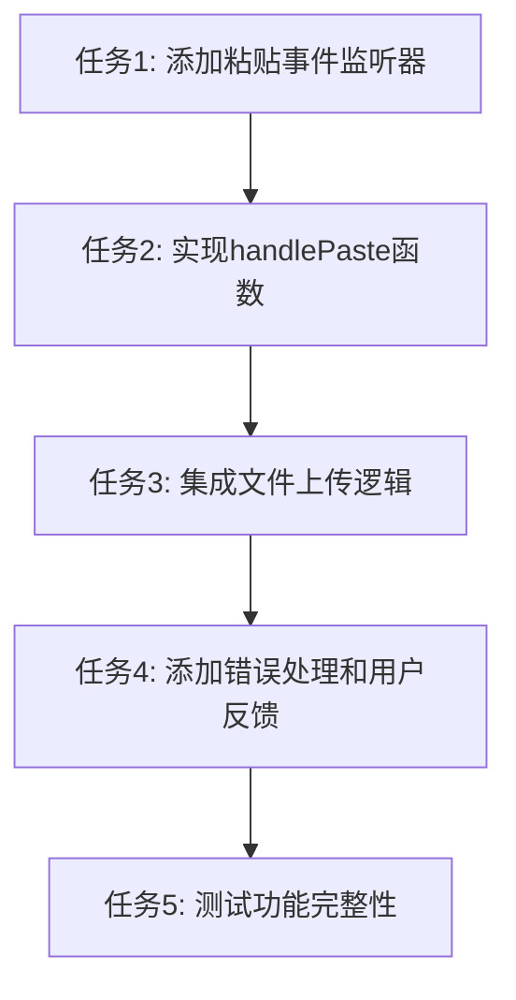

# TASK_复制粘贴上传功能

## 任务依赖图

## 原子化任务列表

### 任务1: 添加粘贴事件监听器
**任务ID**: TASK_001  
**状态**: 待开始  
**复杂度**: 低  

**输入契约**:
- 前置依赖: 无
- 输入数据: ByteMDEditor.vue 组件
- 环境依赖: Vue3 Composition API

**输出契约**:
- 输出数据: 在编辑器上添加 paste 事件监听器
- 交付物: 修改后的 ByteMDEditor.vue 模板部分
- 验收标准: 能够监听到粘贴事件

**实现约束**:
- 技术栈: Vue3 + TypeScript
- 接口规范: 使用 @paste 事件绑定
- 质量要求: 代码简洁，注释清晰

**依赖关系**:
- 后置任务: 任务2
- 并行任务: 无

---

### 任务2: 实现handlePaste函数
**任务ID**: TASK_002  
**状态**: 待开始  
**复杂度**: 中等  

**输入契约**:
- 前置依赖: 任务1完成
- 输入数据: ClipboardEvent 对象
- 环境依赖: 浏览器 Clipboard API

**输出契约**:
- 输出数据: 提取剪贴板中的文件对象
- 交付物: handlePaste 函数实现
- 验收标准: 能够正确提取图片和文件数据

**实现约束**:
- 技术栈: TypeScript + Clipboard API
- 接口规范: 函数签名 `(event: ClipboardEvent) => Promise<void>`
- 质量要求: 包含完整的类型定义和错误处理

**依赖关系**:
- 前置任务: 任务1
- 后置任务: 任务3
- 并行任务: 无

---

### 任务3: 集成文件上传逻辑
**任务ID**: TASK_003  
**状态**: 待开始  
**复杂度**: 中等  

**输入契约**:
- 前置依赖: 任务2完成
- 输入数据: File 对象数组
- 环境依赖: 现有的 uploadImages 函数

**输出契约**:
- 输出数据: 上传后的文件URL数组
- 交付物: 集成后的上传流程
- 验收标准: 能够成功上传文件并返回URL

**实现约束**:
- 技术栈: 复用现有的上传API
- 接口规范: 与现有 uploadImages 函数保持一致
- 质量要求: 保持与现有上传逻辑的一致性

**依赖关系**:
- 前置任务: 任务2
- 后置任务: 任务4
- 并行任务: 无

---

### 任务4: 添加错误处理和用户反馈
**任务ID**: TASK_004  
**状态**: 待开始  
**复杂度**: 低  

**输入契约**:
- 前置依赖: 任务3完成
- 输入数据: 上传过程中的各种状态和错误
- 环境依赖: Ant Design Vue message 组件

**输出契约**:
- 输出数据: 用户友好的提示信息
- 交付物: 完整的错误处理机制
- 验收标准: 能够显示上传进度和错误提示

**实现约束**:
- 技术栈: Ant Design Vue + message API
- 接口规范: 与现有编辑器保持一致的提示方式
- 质量要求: 提供清晰、友好的用户反馈

**依赖关系**:
- 前置任务: 任务3
- 后置任务: 任务5
- 并行任务: 无

---

### 任务5: 测试功能完整性
**任务ID**: TASK_005  
**状态**: 待开始  
**复杂度**: 低  

**输入契约**:
- 前置依赖: 任务4完成
- 输入数据: 各种测试场景（图片、文件、错误情况）
- 环境依赖: 浏览器环境和测试数据

**输出契约**:
- 输出数据: 测试结果和验证报告
- 交付物: 功能验证完成
- 验收标准: 所有功能按预期工作

**实现约束**:
- 技术栈: 手动测试 + 浏览器开发者工具
- 接口规范: 按照验收标准进行测试
- 质量要求: 确保功能稳定可靠

**依赖关系**:
- 前置任务: 任务4
- 后置任务: 无
- 并行任务: 无

## 任务执行顺序

1. **任务1** → **任务2** → **任务3** → **任务4** → **任务5**
2. 每个任务必须在前置任务完成后才能开始
3. 任务2和任务3是核心实现，需要重点关注
4. 任务4和任务5确保功能质量和用户体验

## 风险控制

### 高风险任务
- **任务3**: 文件上传逻辑集成，需要确保与现有API完全兼容

### 风险缓解措施
- 在任务3中充分测试与现有上传API的兼容性
- 在任务4中提供详细的错误信息，便于问题排查
- 在任务5中进行全面的功能测试，确保稳定性

## 验收标准汇总

### 功能验收
1. 能够通过Ctrl+V粘贴图片并自动上传
2. 能够通过Ctrl+V粘贴文件并自动上传
3. 上传成功后自动插入Markdown链接
4. 提供适当的上传进度和错误提示
5. 与现有编辑器功能保持一致的用户体验

### 技术验收
1. 代码遵循项目现有规范和架构模式
2. 与现有上传API完全兼容
3. 错误处理机制完善
4. 性能不影响编辑器其他功能
5. 代码可读性和可维护性良好
