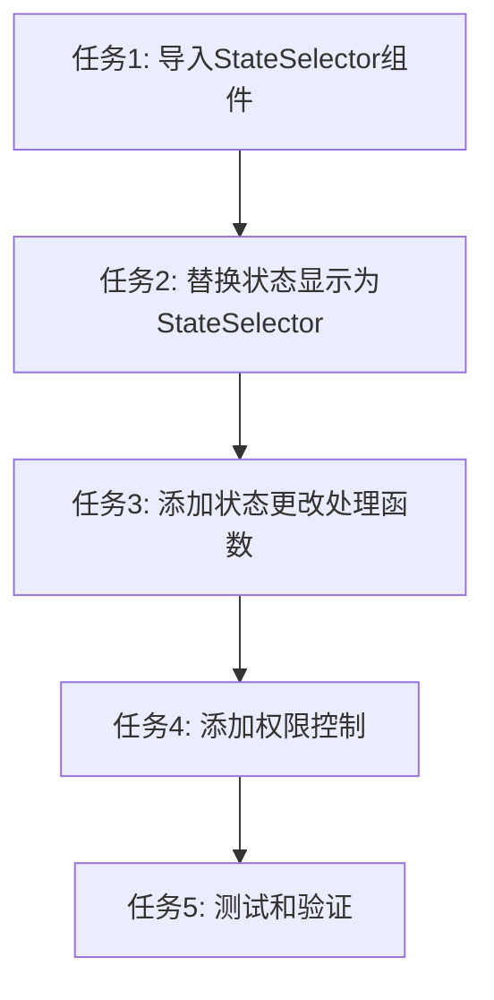

# TASK_状态更改功能

## 子任务拆分

### 任务1: 导入StateSelector组件
**输入契约:**
- 前置依赖: 无
- 输入数据: 无
- 环境依赖: StateSelector组件已存在

**输出契约:**
- 输出数据: StateSelector组件成功导入
- 交付物: 更新的import语句
- 验收标准: 组件导入无错误，TypeScript类型检查通过

**实现约束:**
- 技术栈: Vue3 + TypeScript
- 接口规范: 使用现有的StateSelector组件接口
- 质量要求: 遵循项目代码规范

**依赖关系:**
- 后置任务: 任务2
- 并行任务: 无

### 任务2: 替换状态显示为StateSelector
**输入契约:**
- 前置依赖: 任务1完成
- 输入数据: 当前状态值、项目ID、事项类型
- 环境依赖: StateSelector组件已导入

**输出契约:**
- 输出数据: 状态显示区域使用StateSelector组件
- 交付物: 更新的模板代码
- 验收标准: 状态选择器正确显示，支持交互

**实现约束:**
- 技术栈: Vue3 + Ant Design Vue
- 接口规范: 使用StateSelector的Props接口
- 质量要求: 保持现有UI风格一致

**依赖关系:**
- 前置任务: 任务1
- 后置任务: 任务3
- 并行任务: 无

### 任务3: 添加状态更改处理函数
**输入契约:**
- 前置依赖: 任务2完成
- 输入数据: 新状态值、状态对象
- 环境依赖: changeState方法已存在

**输出契约:**
- 输出数据: 状态更改处理函数
- 交付物: handleStateChange函数
- 验收标准: 函数正确处理状态更改，包含错误处理

**实现约束:**
- 技术栈: Vue3 + TypeScript
- 接口规范: 复用现有changeState方法
- 质量要求: 包含完整的错误处理和用户反馈

**依赖关系:**
- 前置任务: 任务2
- 后置任务: 任务4
- 并行任务: 无

### 任务4: 添加权限控制
**输入契约:**
- 前置依赖: 任务3完成
- 输入数据: 用户权限信息
- 环境依赖: 权限系统已配置

**输出契约:**
- 输出数据: 权限控制逻辑
- 交付物: 更新的权限检查代码
- 验收标准: 只有有权限的用户才能更改状态

**实现约束:**
- 技术栈: Vue3 + 现有权限系统
- 接口规范: 使用现有canTransition计算属性
- 质量要求: 权限控制准确无误

**依赖关系:**
- 前置任务: 任务3
- 后置任务: 任务5
- 并行任务: 无

### 任务5: 测试和验证
**输入契约:**
- 前置依赖: 任务4完成
- 输入数据: 测试用例
- 环境依赖: 开发环境运行正常

**输出契约:**
- 输出数据: 功能测试结果
- 交付物: 测试报告
- 验收标准: 所有功能正常工作，无错误

**实现约束:**
- 技术栈: 浏览器测试
- 接口规范: 用户操作流程
- 质量要求: 功能完整，用户体验良好

**依赖关系:**
- 前置任务: 任务4
- 后置任务: 无
- 并行任务: 无

## 任务依赖图

## 复杂度评估

- **任务1**: 低复杂度 - 简单的import语句
- **任务2**: 中复杂度 - 模板修改和属性绑定
- **任务3**: 中复杂度 - 函数实现和错误处理
- **任务4**: 低复杂度 - 权限检查逻辑
- **任务5**: 中复杂度 - 功能测试和验证

总体复杂度: 中等，预计可在1-2小时内完成
