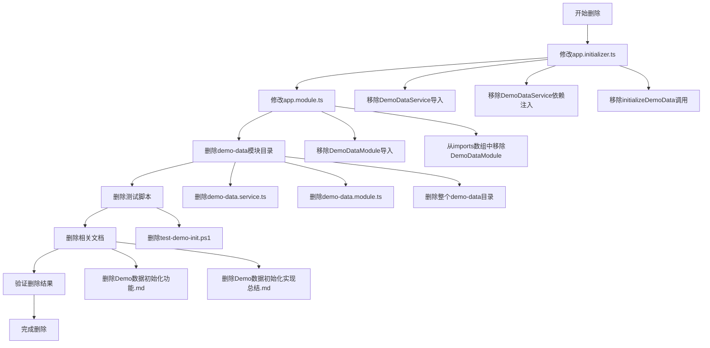
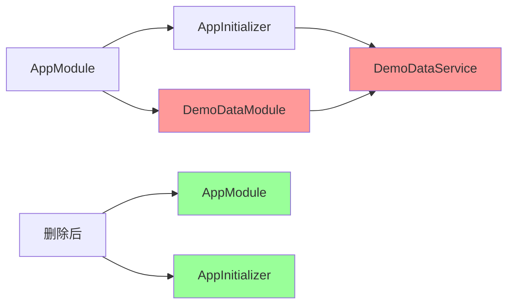
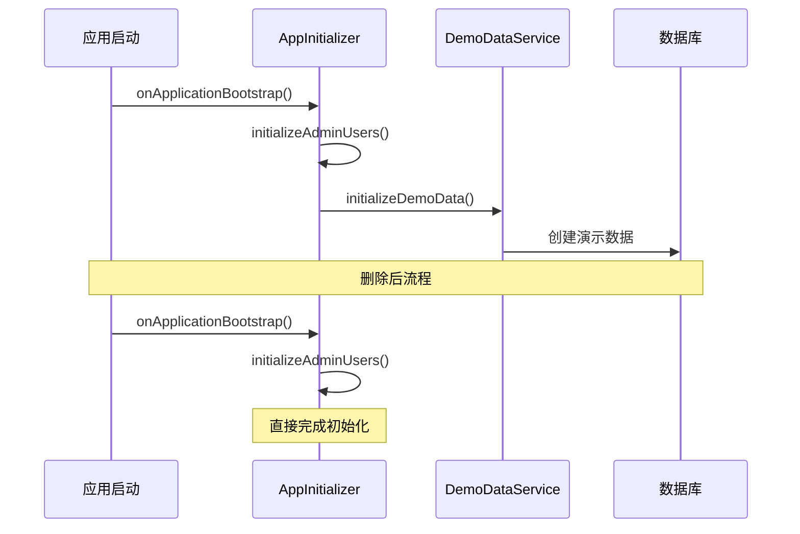

# DESIGN_删除demo-data功能

## 整体架构图



## 分层设计和核心组件

### 1. 代码修改层
- **app.initializer.ts**: 移除DemoDataService相关代码
- **app.module.ts**: 移除DemoDataModule导入

### 2. 文件删除层
- **demo-data模块**: 删除整个模块目录
- **测试脚本**: 删除相关测试文件
- **文档文件**: 删除相关文档

### 3. 验证层
- **编译验证**: 确保无TypeScript错误
- **运行验证**: 确保应用能正常启动
- **功能验证**: 确保核心功能正常

## 模块依赖关系图



## 接口契约定义

### 修改前接口
```typescript
// app.initializer.ts
import { DemoDataService } from './modules/demo-data/demo-data.service';

constructor(
  private readonly demoDataService: DemoDataService
) {}

private async initializeDemoData(): Promise<void> {
  await this.demoDataService.initializeDemoData();
}
```

### 修改后接口
```typescript
// app.initializer.ts
// 移除DemoDataService相关代码
// 保留其他初始化功能
```

## 数据流向图



## 异常处理策略

### 1. 编译错误处理
- **检测**: 使用TypeScript编译器检查
- **处理**: 修复所有编译错误后再继续
- **回滚**: 如有问题，恢复到修改前状态

### 2. 运行时错误处理
- **检测**: 启动应用并检查控制台输出
- **处理**: 修复运行时错误
- **验证**: 确保应用能正常响应请求

### 3. 依赖关系错误处理
- **检测**: 检查import语句和依赖注入
- **处理**: 移除所有相关引用
- **清理**: 删除未使用的import语句

## 删除策略设计原则

### 1. 渐进式删除
- 先移除引用，再删除文件
- 每步删除后立即验证
- 确保应用始终处于可运行状态

### 2. 最小影响原则
- 只删除demo-data相关代码
- 不影响其他功能模块
- 保持现有代码结构

### 3. 完整性原则
- 删除所有相关引用
- 清理所有相关文件
- 保持代码整洁性

## 验证策略

### 1. 编译验证
```bash
cd server
npm run build
```

### 2. 运行验证
```bash
cd server
npm run start
```

### 3. 功能验证
- 检查应用启动日志
- 验证核心功能可用
- 确认无demo-data相关错误

## 风险控制

### 1. 低风险操作
- 删除独立模块文件
- 移除import语句
- 删除测试脚本

### 2. 中风险操作
- 修改app.initializer.ts
- 修改app.module.ts
- 删除文档文件

### 3. 风险缓解
- 每步操作后立即验证
- 保持Git历史记录
- 可以随时回滚
