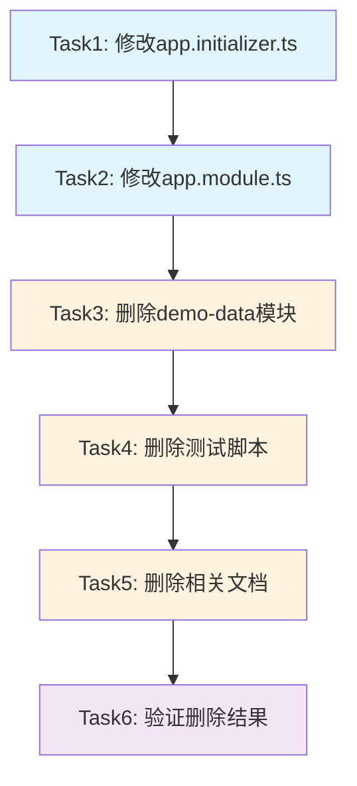

# TASK_删除demo-data功能

## 任务依赖图

## 原子任务列表

### Task1: 修改app.initializer.ts
**优先级**: 高  
**复杂度**: 低  
**预估时间**: 5分钟

#### 输入契约
- **前置依赖**: 无
- **输入数据**: 当前app.initializer.ts文件
- **环境依赖**: TypeScript编译环境

#### 输出契约
- **输出数据**: 修改后的app.initializer.ts文件
- **交付物**: 移除DemoDataService相关代码的文件
- **验收标准**: 
  - 移除DemoDataService导入语句
  - 移除DemoDataService依赖注入
  - 移除initializeDemoData方法调用
  - 文件编译通过

#### 实现约束
- **技术栈**: TypeScript, NestJS
- **接口规范**: 保持现有代码风格
- **质量要求**: 无编译错误，代码整洁

#### 依赖关系
- **后置任务**: Task2
- **并行任务**: 无

---

### Task2: 修改app.module.ts
**优先级**: 高  
**复杂度**: 低  
**预估时间**: 3分钟

#### 输入契约
- **前置依赖**: Task1完成
- **输入数据**: 当前app.module.ts文件
- **环境依赖**: TypeScript编译环境

#### 输出契约
- **输出数据**: 修改后的app.module.ts文件
- **交付物**: 移除DemoDataModule导入的文件
- **验收标准**:
  - 移除DemoDataModule导入语句
  - 从imports数组中移除DemoDataModule
  - 文件编译通过

#### 实现约束
- **技术栈**: TypeScript, NestJS
- **接口规范**: 保持现有代码风格
- **质量要求**: 无编译错误，代码整洁

#### 依赖关系
- **后置任务**: Task3
- **并行任务**: 无

---

### Task3: 删除demo-data模块
**优先级**: 高  
**复杂度**: 低  
**预估时间**: 2分钟

#### 输入契约
- **前置依赖**: Task2完成
- **输入数据**: demo-data模块目录
- **环境依赖**: 文件系统操作权限

#### 输出契约
- **输出数据**: 无（目录已删除）
- **交付物**: 删除整个demo-data模块目录
- **验收标准**:
  - demo-data目录完全删除
  - 无相关文件残留
  - 应用仍能正常启动

#### 实现约束
- **技术栈**: 文件系统操作
- **接口规范**: 无
- **质量要求**: 彻底删除，无残留

#### 依赖关系
- **后置任务**: Task4
- **并行任务**: 无

---

### Task4: 删除测试脚本
**优先级**: 中  
**复杂度**: 低  
**预估时间**: 1分钟

#### 输入契约
- **前置依赖**: Task3完成
- **输入数据**: test-demo-init.ps1文件
- **环境依赖**: 文件系统操作权限

#### 输出契约
- **输出数据**: 无（文件已删除）
- **交付物**: 删除test-demo-init.ps1文件
- **验收标准**:
  - test-demo-init.ps1文件已删除
  - 无相关测试脚本残留

#### 实现约束
- **技术栈**: 文件系统操作
- **接口规范**: 无
- **质量要求**: 彻底删除，无残留

#### 依赖关系
- **后置任务**: Task5
- **并行任务**: 无

---

### Task5: 删除相关文档
**优先级**: 中  
**复杂度**: 低  
**预估时间**: 2分钟

#### 输入契约
- **前置依赖**: Task4完成
- **输入数据**: 相关文档文件
- **环境依赖**: 文件系统操作权限

#### 输出契约
- **输出数据**: 无（文件已删除）
- **交付物**: 删除相关文档文件
- **验收标准**:
  - Demo数据初始化功能.md已删除
  - Demo数据初始化实现总结.md已删除
  - 无相关文档残留

#### 实现约束
- **技术栈**: 文件系统操作
- **接口规范**: 无
- **质量要求**: 彻底删除，无残留

#### 依赖关系
- **后置任务**: Task6
- **并行任务**: 无

---

### Task6: 验证删除结果
**优先级**: 高  
**复杂度**: 中  
**预估时间**: 5分钟

#### 输入契约
- **前置依赖**: Task5完成
- **输入数据**: 修改后的代码库
- **环境依赖**: Node.js, npm, TypeScript编译环境

#### 输出契约
- **输出数据**: 验证报告
- **交付物**: 删除结果验证报告
- **验收标准**:
  - 应用能正常启动
  - 无编译错误
  - 无运行时错误
  - 无demo-data相关代码残留
  - 核心功能正常

#### 实现约束
- **技术栈**: TypeScript, NestJS, Node.js
- **接口规范**: 保持现有功能接口
- **质量要求**: 所有验证项目通过

#### 依赖关系
- **后置任务**: 无
- **并行任务**: 无

## 任务执行顺序

1. **Task1** → **Task2** → **Task3** → **Task4** → **Task5** → **Task6**
2. 每个任务完成后立即验证
3. 如有问题立即停止并记录
4. 所有任务完成后进行最终验证

## 风险控制

### 高风险任务
- **Task1, Task2**: 修改核心文件，需要仔细验证
- **Task6**: 最终验证，确保系统完整性

### 低风险任务
- **Task3, Task4, Task5**: 文件删除操作，风险较低

### 回滚策略
- 每个任务完成后检查Git状态
- 如有问题可以快速回滚到上一个状态
- 保持Git提交记录的完整性
