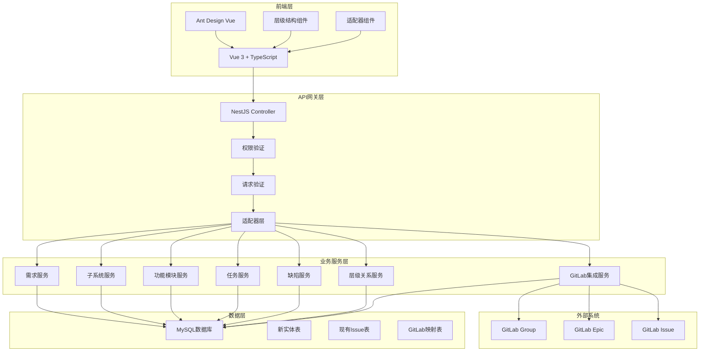
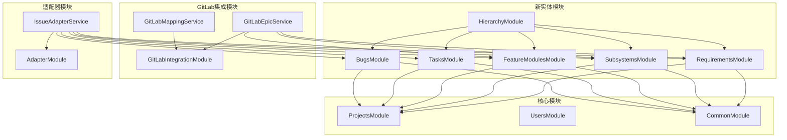
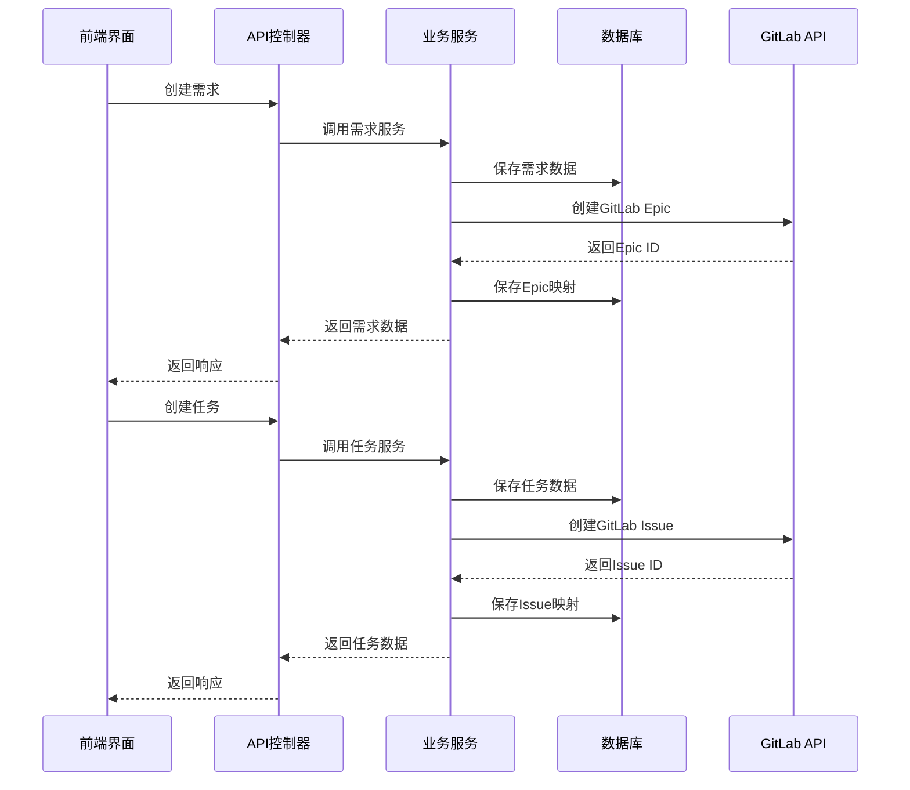

# 项目管理工具重构 - 架构设计阶段

## 整体架构图



## 分层设计和核心组件

### 1. 表现层（Web界面）

#### 层级结构管理界面
- RequirementManager：需求管理组件
- SubsystemManager：子系统管理组件
- FeatureModuleManager：功能模块管理组件
- TaskManager：任务管理组件
- BugManager：缺陷管理组件
- HierarchyView：层级结构视图组件

#### 适配器组件
- IssueAdapter：Issue API适配器
- LegacyComponentWrapper：现有组件包装器

### 2. 应用层（API服务）

#### 核心控制器
```typescript
@Controller('projects/:projectId/requirements')
@UseGuards(JwtAuthGuard, RolesGuard)
@Roles('project_manager', 'admin')
export class RequirementsController {
  @Get()
  async getRequirements() {}
  
  @Post()
  async createRequirement() {}
  
  @Put(':id')
  async updateRequirement() {}
  
  @Delete(':id')
  async deleteRequirement() {}
}

@Controller('projects/:projectId/subsystems')
export class SubsystemsController {
  // 类似结构
}

@Controller('projects/:projectId/feature-modules')
export class FeatureModulesController {
  // 类似结构
}

@Controller('projects/:projectId/tasks')
export class TasksController {
  // 类似结构
}

@Controller('projects/:projectId/bugs')
export class BugsController {
  // 类似结构
}

@Controller('projects/:projectId/hierarchy')
export class HierarchyController {
  @Get()
  async getHierarchy() {}
  
  @Post('move')
  async moveEntity() {}
}
```

#### 适配器控制器
```typescript
@Controller('projects/:projectId/issues')
export class IssuesAdapterController {
  // 保持现有Issue API兼容性
  // 内部调用新的实体服务
}
```

### 3. 领域层（业务服务）

#### 核心服务
```typescript
@Injectable()
export class RequirementsService {
  async create(dto: CreateRequirementDto) {}
  async update(id: string, dto: UpdateRequirementDto) {}
  async delete(id: string) {}
  async getHierarchy(projectId: string) {}
}

@Injectable()
export class SubsystemsService {
  async create(dto: CreateSubsystemDto) {}
  async update(id: string, dto: UpdateSubsystemDto) {}
  async delete(id: string) {}
  async getByRequirement(requirementId: string) {}
}

@Injectable()
export class FeatureModulesService {
  async create(dto: CreateFeatureModuleDto) {}
  async update(id: string, dto: UpdateFeatureModuleDto) {}
  async delete(id: string) {}
  async getBySubsystem(subsystemId: string) {}
}

@Injectable()
export class TasksService {
  async create(dto: CreateTaskDto) {}
  async update(id: string, dto: UpdateTaskDto) {}
  async delete(id: string) {}
  async getByFeatureModule(featureModuleId: string) {}
}

@Injectable()
export class BugsService {
  async create(dto: CreateBugDto) {}
  async update(id: string, dto: UpdateBugDto) {}
  async delete(id: string) {}
  async getByFeatureModule(featureModuleId: string) {}
}

@Injectable()
export class HierarchyService {
  async getHierarchy(projectId: string) {}
  async moveEntity(entityType: string, entityId: string, newParentId: string) {}
  async getChildren(entityType: string, entityId: string) {}
  async getParents(entityType: string, entityId: string) {}
}
```

#### GitLab集成服务扩展
```typescript
@Injectable()
export class GitLabEpicService {
  async createEpic(instance: GitLabInstance, groupId: number, epicData: any) {}
  async updateEpic(instance: GitLabInstance, groupId: number, epicId: number, epicData: any) {}
  async deleteEpic(instance: GitLabInstance, groupId: number, epicId: number) {}
  async syncEpicToGitLab(entityType: string, entityId: string) {}
}

@Injectable()
export class GitLabMappingService {
  async createEpicMapping(entityType: string, entityId: string, gitlabEpicId: number) {}
  async getEpicMapping(entityType: string, entityId: string) {}
  async deleteEpicMapping(entityType: string, entityId: string) {}
}
```

### 4. 基础设施层（数据存储）

#### 实体定义
```typescript
@Entity('requirements')
export class RequirementEntity {
  @PrimaryGeneratedColumn('uuid')
  id!: string;
  
  @Column()
  projectId!: string;
  
  @Column({ length: 140 })
  title!: string;
  
  @Column({ type: 'mediumtext', nullable: true })
  description?: string;
  
  @Column({ length: 32 })
  state!: string;
  
  @Column({ length: 16, nullable: true })
  priority?: string;
  
  @Column({ nullable: true })
  assigneeId?: string;
  
  @Column({ nullable: true })
  reporterId?: string;
  
  @Column({ type: 'int', nullable: true })
  storyPoints?: number;
  
  @Column({ type: 'json', nullable: true })
  labels?: string[];
  
  @Column({ type: 'timestamp', nullable: true })
  dueAt?: Date;
  
  @CreateDateColumn()
  createdAt!: Date;
  
  @UpdateDateColumn()
  updatedAt!: Date;
  
  @Column({ default: false })
  deleted!: boolean;
  
  // 关系
  @OneToMany(() => SubsystemEntity, subsystem => subsystem.requirement)
  subsystems?: SubsystemEntity[];
  
  @OneToMany(() => FeatureModuleEntity, featureModule => featureModule.requirement)
  featureModules?: FeatureModuleEntity[];
  
  @OneToMany(() => TaskEntity, task => task.requirement)
  tasks?: TaskEntity[];
}

@Entity('subsystems')
export class SubsystemEntity {
  @PrimaryGeneratedColumn('uuid')
  id!: string;
  
  @Column()
  projectId!: string;
  
  @Column({ nullable: true })
  requirementId?: string;
  
  @Column({ length: 140 })
  title!: string;
  
  @Column({ type: 'mediumtext', nullable: true })
  description?: string;
  
  @Column({ length: 32 })
  state!: string;
  
  @Column({ nullable: true })
  assigneeId?: string;
  
  @Column({ type: 'json', nullable: true })
  labels?: string[];
  
  @CreateDateColumn()
  createdAt!: Date;
  
  @UpdateDateColumn()
  updatedAt!: Date;
  
  @Column({ default: false })
  deleted!: boolean;
  
  // 关系
  @ManyToOne(() => RequirementEntity, requirement => requirement.subsystems)
  @JoinColumn({ name: 'requirementId' })
  requirement?: RequirementEntity;
  
  @OneToMany(() => FeatureModuleEntity, featureModule => featureModule.subsystem)
  featureModules?: FeatureModuleEntity[];
  
  @OneToMany(() => TaskEntity, task => task.subsystem)
  tasks?: TaskEntity[];
  
  @OneToMany(() => BugEntity, bug => bug.subsystem)
  bugs?: BugEntity[];
}

// 其他实体类似定义...
```

#### GitLab映射表
```typescript
@Entity('gitlab_epic_mappings')
export class GitLabEpicMapping {
  @PrimaryGeneratedColumn('uuid')
  id!: string;
  
  @Column()
  projectId!: string;
  
  @Column()
  gitlabInstanceId!: string;
  
  @Column()
  gitlabGroupId!: number;
  
  @Column()
  gitlabEpicId!: number;
  
  @Column({ type: 'enum', enum: ['requirement', 'subsystem', 'feature_module'] })
  entityType!: string;
  
  @Column()
  entityId!: string;
  
  @Column({ default: true })
  isActive!: boolean;
  
  @CreateDateColumn()
  createdAt!: Date;
  
  @UpdateDateColumn()
  updatedAt!: Date;
  
  @ManyToOne(() => GitLabInstance)
  @JoinColumn({ name: 'gitlabInstanceId' })
  gitlabInstance?: GitLabInstance;
}
```

## 模块依赖关系图



## 接口契约定义

### 1. 层级结构API

```typescript
// 需求管理接口
interface CreateRequirementDto {
  title: string;
  description?: string;
  state?: string;
  priority?: string;
  assigneeId?: string;
  reporterId?: string;
  storyPoints?: number;
  labels?: string[];
  dueAt?: string;
}

interface UpdateRequirementDto {
  title?: string;
  description?: string;
  state?: string;
  priority?: string;
  assigneeId?: string;
  reporterId?: string;
  storyPoints?: number;
  labels?: string[];
  dueAt?: string;
}

interface RequirementResponse {
  id: string;
  projectId: string;
  title: string;
  description?: string;
  state: string;
  priority?: string;
  assigneeId?: string;
  reporterId?: string;
  storyPoints?: number;
  labels?: string[];
  dueAt?: string;
  createdAt: string;
  updatedAt: string;
  subsystems?: SubsystemResponse[];
  featureModules?: FeatureModuleResponse[];
  tasks?: TaskResponse[];
}

// 其他实体接口类似定义...
```

### 2. 层级关系API

```typescript
interface HierarchyResponse {
  requirements: RequirementNode[];
  subsystems: SubsystemNode[];
  featureModules: FeatureModuleNode[];
  tasks: TaskNode[];
  bugs: BugNode[];
}

interface RequirementNode {
  id: string;
  title: string;
  state: string;
  children: {
    subsystems: SubsystemNode[];
    featureModules: FeatureModuleNode[];
    tasks: TaskNode[];
  };
}

interface MoveEntityDto {
  entityType: 'requirement' | 'subsystem' | 'feature_module' | 'task' | 'bug';
  entityId: string;
  newParentType?: 'requirement' | 'subsystem' | 'feature_module';
  newParentId?: string;
}
```

### 3. GitLab集成API

```typescript
interface CreateEpicMappingDto {
  gitlabInstanceId: string;
  gitlabGroupId: number;
  gitlabEpicId: number;
  entityType: 'requirement' | 'subsystem' | 'feature_module';
  entityId: string;
}

interface EpicMappingResponse {
  id: string;
  projectId: string;
  gitlabInstanceId: string;
  gitlabGroupId: number;
  gitlabEpicId: number;
  entityType: string;
  entityId: string;
  isActive: boolean;
  createdAt: string;
  updatedAt: string;
}
```

## 数据流向图



## 异常处理策略

### 1. 数据一致性异常
```typescript
class DataConsistencyException extends Error {
  constructor(message: string, public entityType: string, public entityId: string) {
    super(message);
  }
}

// 处理策略
- 事务回滚：确保数据一致性
- 补偿机制：自动修复不一致数据
- 告警通知：通知管理员处理
```

### 2. GitLab同步异常
```typescript
class GitLabSyncException extends Error {
  constructor(message: string, public entityType: string, public entityId: string) {
    super(message);
  }
}

// 处理策略
- 重试机制：指数退避重试
- 降级处理：本地操作继续，标记同步失败
- 手动同步：提供手动同步接口
```

### 3. 层级关系异常
```typescript
class HierarchyException extends Error {
  constructor(message: string, public entityType: string, public entityId: string) {
    super(message);
  }
}

// 处理策略
- 循环检测：防止循环依赖
- 层级验证：确保层级关系合法
- 自动修复：尝试自动修复层级关系
```

## 安全设计

### 1. 权限控制
- 基于现有RBAC系统扩展
- 支持实体级别的权限控制
- 支持层级权限继承

### 2. 数据安全
- 敏感信息加密存储
- 传输过程HTTPS加密
- 访问日志记录

### 3. GitLab集成安全
- API密钥加密存储
- Webhook签名验证
- 访问权限控制

## 性能优化策略

### 1. 数据库优化
- 合理的索引设计
- 查询优化
- 连接池管理

### 2. 缓存策略
- Redis缓存热点数据
- 层级关系缓存
- 查询结果缓存

### 3. 异步处理
- 事件队列处理
- 批量操作
- 定时任务

## 监控和日志

### 1. 业务监控
- 实体创建/更新/删除监控
- 层级关系变更监控
- GitLab同步状态监控

### 2. 性能监控
- API响应时间监控
- 数据库查询性能监控
- 缓存命中率监控

### 3. 日志管理
- 结构化日志
- 操作审计日志
- 错误日志分析

## 部署和运维

### 1. 数据库迁移
- 渐进式迁移脚本
- 数据完整性验证
- 回滚机制

### 2. 服务部署
- 蓝绿部署
- 滚动更新
- 健康检查

### 3. 监控告警
- 服务状态监控
- 性能指标告警
- 错误率告警

## 质量门控

### 1. 代码质量
- TypeScript类型检查
- ESLint代码规范
- 单元测试覆盖

### 2. 集成测试
- API集成测试
- GitLab集成测试
- 数据迁移测试

### 3. 性能测试
- 负载测试
- 压力测试
- 数据库性能测试

架构设计完成，可以进入ATOMIZE阶段进行任务拆分。
