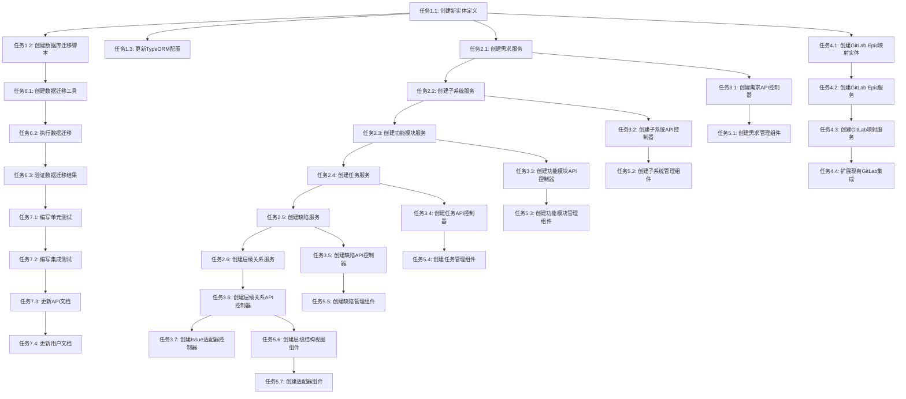

# 项目管理工具重构 - 原子化阶段

## 子任务拆分

### 阶段1：数据模型重构（优先级：高）

#### 任务1.1：创建新实体定义
**输入契约**：
- 现有IssueEntity结构
- 需求规格说明2.0的实体定义

**输出契约**：
- RequirementEntity实体定义
- SubsystemEntity实体定义
- FeatureModuleEntity实体定义
- TaskEntity实体定义
- BugEntity实体定义
- 所有实体的TypeORM装饰器配置

**实现约束**：
- 使用TypeORM装饰器
- 遵循现有命名约定
- 包含完整的字段定义和关系

**依赖关系**：无

#### 任务1.2：创建数据库迁移脚本
**输入契约**：
- 新实体定义
- 现有数据库结构

**输出契约**：
- 创建新表的迁移脚本
- 数据迁移脚本（从Issue表到新实体）
- 回滚脚本

**实现约束**：
- 使用TypeORM迁移
- 支持数据完整性验证
- 支持增量迁移

**依赖关系**：任务1.1

#### 任务1.3：更新TypeORM配置
**输入契约**：
- 新实体定义
- 现有typeorm-data-source.ts

**输出契约**：
- 更新后的TypeORM配置
- 新实体注册
- 迁移配置更新

**实现约束**：
- 保持现有配置兼容性
- 支持新实体注册
- 配置迁移路径

**依赖关系**：任务1.1

### 阶段2：业务服务层重构（优先级：高）

#### 任务2.1：创建需求服务
**输入契约**：
- RequirementEntity定义
- 现有IssuesService结构

**输出契约**：
- RequirementsService类
- 完整的CRUD操作
- 层级关系查询方法
- 单元测试

**实现约束**：
- 遵循现有服务模式
- 包含完整的错误处理
- 支持分页和筛选

**依赖关系**：任务1.1

#### 任务2.2：创建子系统服务
**输入契约**：
- SubsystemEntity定义
- RequirementsService结构

**输出契约**：
- SubsystemsService类
- 完整的CRUD操作
- 层级关系查询方法
- 单元测试

**实现约束**：
- 支持与需求的关联
- 包含层级关系验证
- 支持批量操作

**依赖关系**：任务2.1

#### 任务2.3：创建功能模块服务
**输入契约**：
- FeatureModuleEntity定义
- SubsystemsService结构

**输出契约**：
- FeatureModulesService类
- 完整的CRUD操作
- 层级关系查询方法
- 单元测试

**实现约束**：
- 支持与需求和子系统的关联
- 包含层级关系验证
- 支持状态管理

**依赖关系**：任务2.2

#### 任务2.4：创建任务服务
**输入契约**：
- TaskEntity定义
- FeatureModulesService结构

**输出契约**：
- TasksService类
- 完整的CRUD操作
- 层级关系查询方法
- 工时管理方法
- 单元测试

**实现约束**：
- 支持与需求/子系统/功能模块的关联
- 包含工时计算逻辑
- 支持子任务管理

**依赖关系**：任务2.3

#### 任务2.5：创建缺陷服务
**输入契约**：
- BugEntity定义
- TasksService结构

**输出契约**：
- BugsService类
- 完整的CRUD操作
- 层级关系查询方法
- 严重级别管理
- 单元测试

**实现约束**：
- 支持与子系统/功能模块的关联
- 包含缺陷生命周期管理
- 支持优先级和严重级别

**依赖关系**：任务2.4

#### 任务2.6：创建层级关系服务
**输入契约**：
- 所有新实体定义
- 现有服务结构

**输出契约**：
- HierarchyService类
- 层级查询方法
- 实体移动方法
- 层级验证方法
- 单元测试

**实现约束**：
- 支持跨实体层级查询
- 包含循环依赖检测
- 支持批量移动操作

**依赖关系**：任务2.5

### 阶段3：API层重构（优先级：高）

#### 任务3.1：创建需求API控制器
**输入契约**：
- RequirementsService
- 现有IssuesController结构

**输出契约**：
- RequirementsController类
- 完整的REST API端点
- 请求验证DTO
- 响应DTO
- API文档

**实现约束**：
- 遵循现有API模式
- 包含完整的权限控制
- 支持分页和筛选

**依赖关系**：任务2.1

#### 任务3.2：创建子系统API控制器
**输入契约**：
- SubsystemsService
- RequirementsController结构

**输出契约**：
- SubsystemsController类
- 完整的REST API端点
- 请求验证DTO
- 响应DTO
- API文档

**实现约束**：
- 支持层级关系API
- 包含权限控制
- 支持批量操作

**依赖关系**：任务3.1

#### 任务3.3：创建功能模块API控制器
**输入契约**：
- FeatureModulesService
- SubsystemsController结构

**输出契约**：
- FeatureModulesController类
- 完整的REST API端点
- 请求验证DTO
- 响应DTO
- API文档

**实现约束**：
- 支持多层级关联
- 包含状态管理API
- 支持批量操作

**依赖关系**：任务3.2

#### 任务3.4：创建任务API控制器
**输入契约**：
- TasksService
- FeatureModulesController结构

**输出契约**：
- TasksController类
- 完整的REST API端点
- 请求验证DTO
- 响应DTO
- API文档

**实现约束**：
- 支持工时管理API
- 包含子任务管理
- 支持状态转换

**依赖关系**：任务3.3

#### 任务3.5：创建缺陷API控制器
**输入契约**：
- BugsService
- TasksController结构

**输出契约**：
- BugsController类
- 完整的REST API端点
- 请求验证DTO
- 响应DTO
- API文档

**实现约束**：
- 支持缺陷生命周期API
- 包含优先级管理
- 支持批量操作

**依赖关系**：任务3.4

#### 任务3.6：创建层级关系API控制器
**输入契约**：
- HierarchyService
- 现有控制器结构

**输出契约**：
- HierarchyController类
- 层级查询API
- 实体移动API
- 层级验证API
- API文档

**实现约束**：
- 支持跨实体操作
- 包含权限控制
- 支持批量操作

**依赖关系**：任务3.5

#### 任务3.7：创建Issue适配器控制器
**输入契约**：
- 所有新服务
- 现有IssuesController

**输出契约**：
- IssuesAdapterController类
- 现有Issue API的适配器实现
- 向后兼容性保证
- API文档

**实现约束**：
- 保持现有API兼容性
- 内部调用新服务
- 支持数据转换

**依赖关系**：任务3.6

### 阶段4：GitLab集成扩展（优先级：中）

#### 任务4.1：创建GitLab Epic映射实体
**输入契约**：
- 新实体定义
- 现有GitLab映射实体

**输出契约**：
- GitLabEpicMapping实体
- 映射关系定义
- 索引配置

**实现约束**：
- 遵循现有映射模式
- 包含完整的字段定义
- 支持多实例映射

**依赖关系**：任务1.1

#### 任务4.2：创建GitLab Epic服务
**输入契约**：
- GitLabEpicMapping实体
- 现有GitLab API服务

**输出契约**：
- GitLabEpicService类
- Epic CRUD操作
- 同步方法
- 单元测试

**实现约束**：
- 基于现有GitLab API服务
- 支持批量操作
- 包含错误处理

**依赖关系**：任务4.1

#### 任务4.3：创建GitLab映射服务
**输入契约**：
- GitLabEpicMapping实体
- GitLabEpicService

**输出契约**：
- GitLabMappingService类
- 映射管理方法
- 同步状态跟踪
- 单元测试

**实现约束**：
- 支持多实体类型映射
- 包含同步状态管理
- 支持批量同步

**依赖关系**：任务4.2

#### 任务4.4：扩展现有GitLab集成
**输入契约**：
- 所有新服务
- 现有GitLab集成服务

**输出契约**：
- 更新的GitLab集成服务
- Epic同步逻辑
- 层级关系同步
- 集成测试

**实现约束**：
- 保持现有功能兼容性
- 支持增量同步
- 包含冲突解决

**依赖关系**：任务4.3

### 阶段5：前端组件重构（优先级：中）

#### 任务5.1：创建需求管理组件
**输入契约**：
- 需求API端点
- 现有Issue组件结构

**输出契约**：
- RequirementManager.vue组件
- 需求列表视图
- 需求创建/编辑表单
- 单元测试

**实现约束**：
- 使用Vue 3 Composition API
- 遵循现有组件模式
- 包含完整的表单验证

**依赖关系**：任务3.1

#### 任务5.2：创建子系统管理组件
**输入契约**：
- 子系统API端点
- RequirementManager组件

**输出契约**：
- SubsystemManager.vue组件
- 子系统列表视图
- 子系统创建/编辑表单
- 单元测试

**实现约束**：
- 支持与需求的关联
- 包含层级关系显示
- 支持批量操作

**依赖关系**：任务5.1

#### 任务5.3：创建功能模块管理组件
**输入契约**：
- 功能模块API端点
- SubsystemManager组件

**输出契约**：
- FeatureModuleManager.vue组件
- 功能模块列表视图
- 功能模块创建/编辑表单
- 单元测试

**实现约束**：
- 支持多层级关联
- 包含状态管理
- 支持拖拽排序

**依赖关系**：任务5.2

#### 任务5.4：创建任务管理组件
**输入契约**：
- 任务API端点
- FeatureModuleManager组件

**输出契约**：
- TaskManager.vue组件
- 任务列表视图
- 任务创建/编辑表单
- 工时管理界面
- 单元测试

**实现约束**：
- 支持工时跟踪
- 包含子任务管理
- 支持看板视图

**依赖关系**：任务5.3

#### 任务5.5：创建缺陷管理组件
**输入契约**：
- 缺陷API端点
- TaskManager组件

**输出契约**：
- BugManager.vue组件
- 缺陷列表视图
- 缺陷创建/编辑表单
- 严重级别管理
- 单元测试

**实现约束**：
- 支持缺陷生命周期
- 包含优先级管理
- 支持批量操作

**依赖关系**：任务5.4

#### 任务5.6：创建层级结构视图组件
**输入契约**：
- 层级关系API端点
- 所有管理组件

**输出契约**：
- HierarchyView.vue组件
- 树形结构视图
- 拖拽移动功能
- 层级关系编辑
- 单元测试

**实现约束**：
- 支持多层级显示
- 包含拖拽操作
- 支持展开/折叠

**依赖关系**：任务5.5

#### 任务5.7：创建适配器组件
**输入契约**：
- 所有新组件
- 现有Issue组件

**输出契约**：
- IssueAdapter.vue组件
- 现有Issue组件的适配器
- 向后兼容性保证
- 单元测试

**实现约束**：
- 保持现有功能兼容性
- 内部调用新组件
- 支持数据转换

**依赖关系**：任务5.6

### 阶段6：数据迁移（优先级：高）

#### 任务6.1：创建数据迁移工具
**输入契约**：
- 现有Issue数据
- 新实体结构

**输出契约**：
- 数据迁移脚本
- 数据验证工具
- 迁移进度监控
- 回滚工具

**实现约束**：
- 支持增量迁移
- 包含数据完整性验证
- 支持大容量数据迁移

**依赖关系**：任务1.2

#### 任务6.2：执行数据迁移
**输入契约**：
- 数据迁移工具
- 现有数据库

**输出契约**：
- 迁移后的数据库
- 迁移报告
- 数据完整性验证结果

**实现约束**：
- 保持数据完整性
- 支持回滚操作
- 包含进度监控

**依赖关系**：任务6.1

#### 任务6.3：验证数据迁移结果
**输入契约**：
- 迁移后的数据库
- 原始数据

**输出契约**：
- 数据完整性报告
- 迁移验证结果
- 性能测试报告

**实现约束**：
- 全面验证数据完整性
- 包含性能测试
- 支持问题修复

**依赖关系**：任务6.2

### 阶段7：测试和文档（优先级：中）

#### 任务7.1：编写单元测试
**输入契约**：
- 所有新服务
- 所有新控制器
- 所有新组件

**输出契约**：
- 完整的单元测试套件
- 测试覆盖率报告
- 测试文档

**实现约束**：
- 测试覆盖率 > 80%
- 包含边界条件测试
- 支持持续集成

**依赖关系**：任务6.3

#### 任务7.2：编写集成测试
**输入契约**：
- 所有API端点
- GitLab集成功能

**输出契约**：
- 集成测试套件
- API测试文档
- 性能测试报告

**实现约束**：
- 覆盖所有API端点
- 包含GitLab集成测试
- 支持自动化测试

**依赖关系**：任务7.1

#### 任务7.3：更新API文档
**输入契约**：
- 所有API端点
- 现有API文档

**输出契约**：
- 更新的API文档
- Swagger/OpenAPI规范
- 使用示例

**实现约束**：
- 包含所有新API
- 提供使用示例
- 支持在线测试

**依赖关系**：任务7.2

#### 任务7.4：更新用户文档
**输入契约**：
- 新功能特性
- 现有用户文档

**输出契约**：
- 更新的用户文档
- 功能使用指南
- 迁移指南

**实现约束**：
- 包含新功能说明
- 提供迁移指导
- 支持多语言

**依赖关系**：任务7.3

## 任务依赖图

## 质量门控

### 1. 代码质量
- TypeScript类型检查通过
- ESLint代码规范检查通过
- 单元测试覆盖率 > 80%
- 代码审查通过

### 2. 功能质量
- 所有API端点正常工作
- 层级关系正确维护
- GitLab集成功能正常
- 数据迁移完整性验证

### 3. 性能质量
- API响应时间 < 300ms
- 数据库查询优化
- 内存使用合理
- 并发处理能力满足要求

### 4. 安全质量
- 权限控制有效
- 数据安全保护
- API安全验证
- 无安全漏洞

## 风险缓解

### 1. 技术风险
- 数据迁移失败：提供回滚机制
- 性能问题：进行性能测试和优化
- 兼容性问题：保持API向后兼容

### 2. 业务风险
- 功能缺失：详细的需求分析
- 用户体验问题：用户测试和反馈
- 数据丢失：完整的数据备份

### 3. 项目风险
- 进度延期：合理的任务分解
- 资源不足：优先级管理
- 质量问题：严格的质量门控

任务拆分完成，可以进入APPROVE阶段进行审批。
